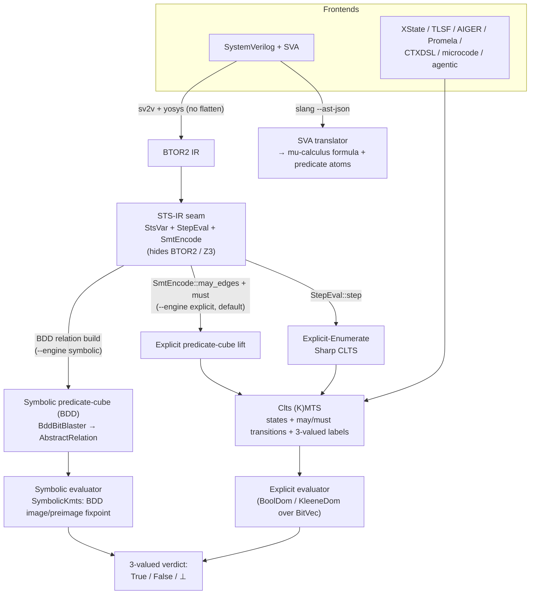
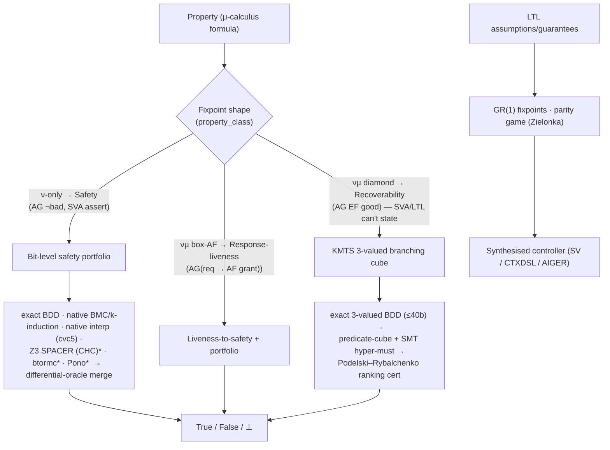

# Mununu

**Formal verification and controller synthesis for reactive systems**

[](https://github.com/vscorza/mununu/actions/workflows/ci.yml)
[](https://www.rust-lang.org/)
[](LICENSE)

**[Video Tutorials](https://www.youtube.com/watch?v=PovNx1rWOy8&list=PL8lIyan4cdjWOUZy32IKu4Yc3Ivi1_YLZ)** &mdash; Watch the Mununu tutorial series on YouTube

## What is Mununu?

Mununu is a verification tool for analyzing and synthesizing controllers for reactive systems modeled as Compositional Labeled Transition Systems (CLTS). It evaluates mu-calculus and LTL properties, performs controller synthesis, and supports compositional modeling of concurrent systems through a dedicated DSL.

## Features

- **CTXDSL** &mdash; A domain-specific language for defining automata, compositions, properties, and controllers with enum types, parameterized automata (process templates), and state groups/wildcards
- **Mu-calculus evaluation** &mdash; Fixpoint-based property verification with bitvec-backed state sets
- **LTL support** &mdash; Linear temporal logic formulas automatically translated to mu-calculus
- **GR(1) specifications** &mdash; Generalized Reactivity(1) properties for reactive synthesis
- **Composition** &mdash; Synchronous, asynchronous, and superset composition of CLTS components
- **Controller synthesis** &mdash; Automatic synthesis of controllers satisfying safety and liveness properties
- **State abstraction** &mdash; Multi-level variable abstraction (Boolean, integer intervals, symbol sets)
- **Format adapters** &mdash; Import from TLSF, AIGER, Promela, XState, SystemVerilog, **CrewAI** (`.crewai.json`), and **LangGraph** (`.langgraph.json`), plus extraction-spec inputs from C / Rust / TypeScript; export controllers to XState JSON or SystemVerilog
- **N-source verify framework** &mdash; `mununu verify <verify.toml>` composes any combination of the above sources, picks an alphabet-binding strategy (direct / explicit renamings / register-map-derived), declares a composition shape, and produces a structured `VerifyReport`. See [`wiki/Verify-Project-Flow.md`](wiki/Verify-Project-Flow.md).
- **RTL property verification** &mdash; Check a SystemVerilog module's own assertions with **no sidecar** via `sv verify-auto`, or decide **safety**, **response-liveness** (`AG(request → AF grant)`), and **recoverability** (`AG EF good` &mdash; the branching "can it always get back?" property SVA cannot express) over SV or BTOR2 with the `sv`/`btor2 verify` / `verify-liveness` / `verify-recoverability` verbs. All speak one verdict vocabulary. See [`docs/verifying-rtl.md`](docs/verifying-rtl.md).
- **CI & agent integration** &mdash; The verify verbs are **CI gates**: the verdict drives the process exit code (`--fail-on`, `--quiet`), so a GitHub Actions step fails on a real violation. An RTL-writing agent can POST raw SV to the HTTP API and get per-property verdicts back. See [`wiki/CI-and-Agent-Integration.md`](wiki/CI-and-Agent-Integration.md).
- **REST API** &mdash; Built-in HTTP server for integration with web frontends
- **Web UI** &mdash; Interactive editor, graph visualization, and verification via [mununu-ui](https://github.com/vscorza/mununu-ui)

## Quick Start

```bash
# Build from source
git clone https://github.com/vscorza/mununu.git
cd mununu
cargo build --release

# Verify a handshake protocol
cargo run -- context eval examples/hw/handshake.ctxdsl \
  --formula ack_reachable --automaton Handshake

# Synthesize a controller (six extraction modes; see wiki/Controller-Modes.md)
cargo run -- context synth examples/hw/handshake.ctxdsl \
  --formula safety_invariant --automaton Handshake \
  --controller-mode parity-game

# Generate a graph visualization
cargo run -- context graph examples/hw/handshake.ctxdsl \
  --output handshake.html

# Start the API server (for use with mununu-ui)
cargo run --features api -- server --addr 127.0.0.1:8080
```

## Examples

The `examples/` directory contains ready-to-use CLTS specifications:

| Example | Description | States | Properties |
|---------|-------------|--------|------------|
| [Handshake Protocol](examples/hw/handshake.ctxdsl) | Req/Ack handshake with latency | 4 | Safety, reachability, liveness |
| [Round-Robin Arbiter](examples/hw/arbiter.ctxdsl) | 2-client mutual exclusion arbiter | 3 | Mutual exclusion, fairness |
| [Traffic Light](examples/hw/traffic_light.ctxdsl) | Timer-driven 4-phase controller | 4 | Cycle reachability, transition checks |
| [Ready/Valid Adapter](examples/hw/rv_adapter.ctxdsl) | Skid buffer for backpressure | 2 | Buffer reachability, drain/push |
| [AMBA Bus Arbiter](examples/amba_arbiter_gr1.ctxdsl) | 2-client GR(1) bus arbiter | 3+3+3 | GR(1) mutual exclusion, no starvation |
| [Fair Elevator](examples/elevator_gr1.ctxdsl) | 3-floor GR(1) elevator controller | 6+4 | Floor reachability, full traversal |
| [Sterile Batch Release](examples/sterile_batch_release.ctxdsl) | Pharmaceutical BPM pipeline | 14 | Ship-requires-release, disposition |
| [AMBA 4-Client Synthesis](examples/amba_arbiter_gr1_synthesis.ctxdsl) | 4-client arbiter with synthesis | 5+12 | 6 mutual exclusion pairs, GR(1) liveness |
| [Bus Arbiter Retry](examples/bus_arbiter_retry.ctxdsl) | Recurrence-after-stability (alt 4) | 4 | Demonstrates ParityGame mode beyond GR(1) — see [Controller Modes](https://github.com/your-org/mununu/wiki/Controller-Modes) |
| [Dual-Channel Arbiter](examples/dual_arbiter_alt4.ctxdsl) | Two channels, dual recurrence-after-stability (alt 4) | 16 | Memory + strategy selection — synthesis disables 17 controllable transitions; ParityGame keeps the parity-correct strategy |

### Agentic AI Orchestration

| Example | Description | Composition | Properties |
|---------|-------------|-------------|------------|
| [Customer Support Pipeline](examples/agentic/support_pipeline.xstate.json) | XState parallel: triage + budget tracking | 5+2 (parallel) | No tool over budget (safety) |
| [MCP Tool Authorization](examples/agentic/mcp_auth.ctxdsl) | Session + confirmation gate protocol | 3+4 (async) | Session-required, confirm-before-delete |
| [Multi-Agent Handoff](examples/agentic/handoff_protocol.ctxdsl) | Supervisor + 2 specialist agents | 4+3+3 (async) | Mutual exclusion, GR(1) liveness |

### Verify Framework (`mununu verify <verify.toml>`)

Each entry under [`examples/verify/`](examples/verify/) ships a `verify.toml`, the referenced source files, a `validate.sh` reproduction script, and a byte-deterministic `transcript.txt`:

| Example | Sources | Binding | What it demonstrates |
|---------|---------|---------|----------------------|
| [`xstate_pair/`](examples/verify/xstate_pair/) | XState × 2 | direct | Multiple sources via the same adapter; mixed inline + template properties |
| [`microprogram_plus_sv/`](examples/verify/microprogram_plus_sv/) | hand-authored CTXDSL + SystemVerilog | direct | Microcode + RTL pairing through the framework |
| [`uart_codesign_chaotic/`](examples/verify/uart_codesign_chaotic/) | C firmware + chaotic-stub peripheral | register-map | Codesign C+SV with register-map-derived rendezvous labels |
| [`uart_codesign_protocol_spec/`](examples/verify/uart_codesign_protocol_spec/) | C firmware + hand-authored protocol spec | direct | The "protocol-spec recipe" inside the framework |
| [`crewai_handoff/`](examples/verify/crewai_handoff/) | CrewAI 2-agent crew | direct | Native CrewAI adapter end-to-end |
| [`langgraph_workflow/`](examples/verify/langgraph_workflow/) | LangGraph triage workflow | direct | Native LangGraph adapter end-to-end |

Reproduce any of them: `bash examples/verify/<example>/validate.sh`

## CTXDSL at a Glance

```
context handshake {
    alphabet {
        label req_assert;
        label ack_assert;
        label ack_deassert;
    }

    automata {
        automaton Handshake {
            controllable { label ack_assert; label ack_deassert; }
            states {
                state Idle initial;
                state WaitAck;
                state Active;
            }
            transitions {
                transition Idle -> WaitAck on label req_assert;
                transition WaitAck -> Active on label ack_assert;
                transition Active -> Idle on label ack_deassert;
            }
        }
    }

    mu_formulas {
        // Reachability: Active is reachable from any state
        formula ack_reachable {
            over Handshake;
            body = mu X. (Active || <> X);
        }

        // GR(1): GF(request) -> GF(active)
        formula gr1_liveness {
            over Handshake;
            body = (! (nu X. (mu Y. (WaitAck || <> Y)) && ([] X)))
                || (nu Z. (mu W. (Active || <> W)) && ([] Z));
        }
    }

    controllers {
        controller safe_handshake {
            source Handshake;
            satisfying ack_reachable;
        }
    }
}
```

## Architecture

Mununu verifies by three orthogonal choices: **abstraction** (explicit-state vs
predicate cubes), **engine** (explicit enumeration vs symbolic BDD), and **domain**
(2-valued for exact models vs 3-valued Kleene may/must for sound abstraction). All
paths flow through a frontend-agnostic transition-system seam (STS-IR) into one
3-valued verdict vocabulary — `True` / `False` / `⊥` (abstraction too coarse to
decide, never a false claim).



The full design — predicate abstraction, explicit & symbolic model checking, the IR
layering, and how over/under/⊥ approximation and may/must edges operate — is in
[`docs/design/post-rf5-architecture.md`](docs/design/post-rf5-architecture.md).

### Verification engines

A property's fixpoint shape routes it to one of two families. The verdict vocabulary is
always `True` / `False` / `⊥` — a definite verdict is sound; `⊥` means "the abstraction
can't decide," never a false claim.



_* = external subprocess (btormc, Pono); every other engine is mununu-owned (z3/cvc5 are linked libraries or interpolation calls)._

**Bit-level safety portfolio** — decides `AG ¬bad` (SVA `assert` / BTOR2 `bad`
reachability). [`adapter/reach_portfolio.rs`](crates/mununu-core/src/adapter/reach_portfolio.rs)
runs several sound members under a *differential-oracle* merge: the first definite verdict
wins, and two disagreeing definite verdicts raise a `Contradiction` alarm rather than
guessing. Any timeout / absent tool / inconclusive is a sound `⊥`.

"Owner" is *whose model-checking algorithm runs the search*, not merely which library is
linked — an important distinction. mununu-owned means mununu drives the search loop and uses
z3/cvc5 only as per-query oracles; external means an outside model checker runs the whole
search (whether linked in-process, like Z3's SPACER, or a subprocess, like btormc/Pono).

| Engine | Algorithm owner | Method |
|---|---|---|
| Exact BDD reachability | **mununu** (OxiDD, in-process) | ≤40-bit exact; refuses an unsound "safe" on free init |
| Native BMC + k-induction | **mununu** (drives the unroll; z3 answers per-depth SAT) | word-level counterexample + inductive proof |
| Native McMillan interpolation | **mununu** (drives the forward-reach k-schedule; cvc5 answers per-interpolant queries) | last-resort; uniquely decides HWMCC `gen12/14/39` |
| SPACER (IC3/PDR) via CHC | **external algorithm — Z3's SPACER** (in-process); mununu owns only the btor2→CHC *encoding* | Z3 solves the Horn-clause problem end-to-end |
| btormc | **external** (subprocess) | BMC + k-induction |
| Pono | **external** (subprocess) | IC3/PDR (`ic3bits`) |

So mununu-owned model-checking algorithms are the exact BDD engine, native BMC,
native k-induction, and native McMillan interpolation; the `native_spacer` path is a **Z3
SPACER frontend** — mununu builds the CHC encoding, Z3 runs the IC3/PDR search. (On the
HWMCC run below, that means only 2 of the 41 decides come from a mununu-owned safety
algorithm; the rest are Z3 SPACER, btormc, or Pono.)

**KMTS 3-valued branching cube** — the differentiator: it decides *branching-time*
μ-calculus that SVA and LTL **cannot state**, most notably recoverability `AG EF good`
("from every reachable state, a good state is still reachable") and `AG AF`. Every engine
here is mununu-owned. Definite verdicts are sound at *every* alternation depth
(Bruns–Godefroid). An exact 3-valued BDD / enumeration path (≤40-bit) escalates, over wide
datapaths, to a predicate-cube + SMT hyper-must abstraction and a Podelski–Rybalchenko
**ranking certificate** (single-register, ∃-input, and lexicographic) that decides
well-founded-descent cases no bounded cube captures.
[`adapter/recoverability.rs`](crates/mununu-core/src/adapter/recoverability.rs),
[`adapter/btor2/symbolic_bitblast.rs`](crates/mununu-core/src/adapter/btor2/symbolic_bitblast.rs).

**Synthesis** — sound GR(1) via direct Piterman–Pnueli–Sá'ar symbolic μ-calculus
fixpoints, plus a Zielonka parity-game solver for higher alternation. Rejected LTL clauses
are reported, never silently dropped.
[`mu_calculus/gr1.rs`](crates/mununu-core/src/mu_calculus/gr1.rs),
[`mu_calculus/parity_game.rs`](crates/mununu-core/src/mu_calculus/parity_game.rs).

**Honest boundaries.** The exact engines cap at 40 register+input bits and abstain above.
The IC3ia predicate-abstraction ladder
([`adapter/btor2/abs_safety.rs`](crates/mununu-core/src/adapter/btor2/abs_safety.rs)) is a
guarded research foundation, **not** a production decider — it abstains on real designs.
On the HWMCC bit-level suite the external model checkers (Z3 SPACER, btormc, Pono) do the
bulk of the deciding; the mununu-owned safety algorithms contribute a handful (and the
branching-time decides that no bv tool can state). Deployment vs ownership are separate:
`btormc` / `Pono` / `cvc5` are external **subprocesses**; Z3's SPACER is an external
**algorithm** run in-process via the linked z3 library. z3-as-an-SMT-solver (per-query,
inside native BMC/k-induction/interp) is mununu's search using z3 as an oracle — that part
*is* mununu-owned. `slang` / `sv2v` / `yosys` are SV *front-ends*, not solvers.

### Surfaces — CLI · API · UI

Every production capability ships on the **CLI** (a clap subcommand), the **HTTP API** (an
axum handler under `/api/v1/…`), and the **Web UI** (a typed client in `mununu-ui`) — the
surface-parity rule. The property verbs exist in both an SV-direct form (`sv …`, one call
from raw SystemVerilog) and a BTOR2-direct form (`btor2 …`).

| Capability | CLI | API | UI |
|---|---|---|---|
| SV / BTOR2 safety (`AG ¬bad`, portfolio) | `sv verify`, `btor2 verify` | `POST /sv/verify`, `/btor2/verify` | ✅ |
| **No-sidecar auto SVA verify** | `sv verify-auto` | `POST /sv/verify-auto` | ✅ |
| Response-liveness `AG(req → AF grant)` | `sv verify-liveness[-all]`, `btor2 …` | `POST /{sv,btor2}/verify-liveness[-all]` | ✅ |
| **Recoverability `AG EF good`** (branching) | `sv verify-recoverability`, `btor2 …` | `POST /{sv,btor2}/verify-recoverability` | ✅ |
| FSM illegal-encoding auto-scan | `sv check-fsm`, `btor2 check-fsm` | `POST /{sv,btor2}/check-fsm` | ✅ |
| μ-calculus eval / CEGAR | `context eval`, `{sv,btor2} cegar` | `POST /context/verify`, `/{sv,btor2}/cegar` | ✅ |
| Controller synthesis (GR(1) / parity) | `context synth` | `POST /context/synthesize`, `/synth/gr1` | ✅ |
| N-source project verify (`verify.toml`) | `verify` | `POST /verify` | ✅ |
| KMTS safety cube (`--engine cube\|ic3`) | `btor2 verify-safety` | — (CLI-only) | — |

Full route list: [`api/server.rs`](crates/mununu-core/src/api/server.rs) ·
[`api/handlers.rs`](crates/mununu-core/src/api/handlers.rs) ·
[`mununu-ui/src/api/endpoints.ts`](https://github.com/vscorza/mununu-ui/blob/main/src/api/endpoints.ts).

Source layout — a Cargo workspace (Edition 2024) of three crates:

```
crates/
├── mununu-core/     # lib: verification engine, adapters, composition, IR, shared types
├── mununu-cli/      # bin: `mununu` — CLI + HTTP API server (main.rs, loader.rs)
└── mununu-extract/  # bin: `mununu-extract` — tree-sitter / LLVM / CIRCT AST extraction
```

Inside `mununu-core/src/`:

```
├── adapter/         # Format adapters + RTL frontends (see below)
├── abstraction/     # State-variable abstraction (value domains, unrolling)
├── clts/            # Core CLTS / (K)MTS data structure (builder, label store, modality)
├── codesign/        # HW/SW codesign extraction (register-map rendezvous)
├── composition/     # Synchronous, asynchronous, and superset composition
├── context/         # CLTS registry, synthesis, mu-calculus evaluation engine
├── context_dsl/     # CTXDSL lexer, parser, AST, realization, incremental loading
├── contract/        # Black-box module contracts (chaotic-stub, cyclic discharge)
├── guard/           # Guard expression parsing
├── llvm_ir/         # LLVM IR extraction matchers
├── ltl/             # LTL → mu-calculus translation
├── mu_calculus/     # Formula parsing, fixpoint evaluation; symbolic.rs (BDD engine)
├── mununu_annotations/  # Sidecar annotation schema (SvAnnotation, predicate decls)
├── persistence/     # CLTS disk serialization
├── verify/          # N-source verify framework (verify.toml orchestrator)
└── api/             # REST API server (axum-based, optional `api` feature)
```

The `adapter/` module carries the format adapters and the RTL pipeline: `systemverilog/`,
`slang/`, `yosys/` (SV frontends — SVA translation + sv2v/yosys → BTOR2); `btor2/`,
`btormc/` (BTOR2 IR, predicate-cube lift, model-checker oracle); `cvc5/`, `verilator/`
(Craig interpolation, reset-state seeding); `tlsf/`, `aiger/`, `promela/`, `xstate/`
(classic formats); `crewai/`, `langgraph/`, `microcode/` (agentic + microcode);
`extraction/`, `sidecar/`, `vcd/`, `partition/`; and `sts_ir.rs`, the frontend-agnostic
STS-IR seam.

## How It Compares

| Feature | Mununu | SLUGS | Strix | TLV |
|---------|--------|-------|-------|-----|
| Input language | CTXDSL | structured slugs | TLSF/HOA | SMV |
| Mu-calculus | Yes | No | No | Yes |
| LTL | Yes (translated) | No | Yes (native) | Yes |
| GR(1) synthesis | Yes | Yes (native) | Via LTL | Yes |
| Composition | Sync/Async/Superset | No | No | Yes |
| Web UI | Yes | No | No | No |
| Implementation | Rust | C++ | Rust/C++ | C |
| State abstraction | Yes | No | No | Partial |
| **Branching-time μ-calc (`AG EF` recoverability)** | **Yes** | No | No | Partial |
| **No-sidecar SV → verdict (one call)** | **Yes** | No | No | No |
| **Synthesis _and_ verification, one tool** | **Yes** | Synth only | Synth only | Yes |
| **HTTP API (request-based)** | **Yes** | No | No | No |

The distinctive combination is the last block: mununu both **synthesizes** controllers and
**verifies** RTL — including *branching-time* properties (`AG EF` recoverability) that
assertion languages (SVA) and LTL bounded model checkers cannot express — behind a single
request-based API. Synthesis is absent from every RTL verification tool; branching-time
recoverability is absent from every LTL/SVA tool.

## Building from Source

Requires **Rust 1.91+** (Edition 2024).

```bash
# Clone and build
git clone https://github.com/vscorza/mununu.git
cd mununu
cargo build --release

# Run tests
cargo test

# Install pre-commit hooks
./scripts/setup-hooks.sh

# Build with API server support
cargo build --release --features api
```

### Optional external tools

Several mununu pipelines invoke external tools via subprocess. **All are optional** — mununu functions without them and emits a structured warning when an invoked pipeline requires a missing tool. Each is discovered via a `locate_*` helper (a `MUNUNU_<TOOL>_PATH` env var, then `$PATH`). The currently-invoked tools are slang (SVA front-end for `sv extract-sva` / `sv verify-auto`), sv2v (SystemVerilog normalisation), Yosys (SV → BTOR2), CVC5 (Craig interpolation for the CEGAR loop), btormc (BTOR2 model-checker oracle), and Verilator (reset-state simulation seeding). See [`docs/external-tools.md`](docs/external-tools.md) for the canonical list, per-platform install instructions, and discovery env vars.

## Web UI

The companion [mununu-ui](https://github.com/vscorza/mununu-ui) project provides:

- Monaco-based CTXDSL editor with syntax highlighting
- Interactive graph visualization (Cytoscape/Dagre) with controllable/uncontrollable edge styling
- Unified verification tab with counterstrategy graphs and counterexample traces
- Internationalization (English, Spanish, Portuguese)

```bash
# Start the API server
cargo run --features api -- server --addr 127.0.0.1:8080

# In another terminal, start the UI
cd /path/to/mununu-ui
npm install && npm run dev
# Open http://localhost:5173
```

## Contributing

See [CONTRIBUTING.md](CONTRIBUTING.md) for setup instructions and guidelines.

## License

[Mununu Non-Commercial License](LICENSE)

## References

- N. Piterman, A. Pnueli, and Y. Sa'ar. "Synthesis of Reactive(1) Designs." *VMCAI*, 2006.
- R. Bloem, B. Jobstmann, N. Piterman, A. Pnueli, and Y. Sa'ar. "Synthesis of Reactive(1) Designs." *JCSS*, 78(3), 2012.
