# Post-R-F5 architecture — predicate abstraction, explicit & symbolic model checking

> Concept + design note — an architecture/theory overview, exempt from the
> `Source of truth:` anchor rule per CLAUDE.md §Documentation Traceability. Every
> named symbol below is a real, greppable artifact.
>
> Status (as-built, 2026-07-05): the R-F5 symbolic track has **shipped** — R-F5.0 (the
> OxiDD spike, `mu_calculus/symbolic.rs`) through R-F5.5 (symbolic CEGAR loop, `--engine
> symbolic`, guarded modalities), and **R-F5.6 cone-of-influence is now shipped on BOTH the
> exact and the symbolic bit-blaster** (`build_with_keep` + `dep_graph::cone_leaf_nids`), along
> with bit-blaster op completeness (Mul / barrel shifts / signed compares) and
> combinational-atom binding. On the 15-module OpenTitan differential-oracle corpus this took
> bit-cap-⊥ from 9 to 0 (`measurements/differential-corpus-census.md`). The **remaining**
> R-F5 close-out is BDD variable ordering + cegar-vs-symbolic verdict parity for the
> default-flip (making `symbolic` the default) — see §7.

## 0. TL;DR

- R-F5 does **not** replace mununu's automata foundation. The `Clts` (K)MTS model, the
  composition engine, the mu-calculus evaluator, and every non-SV adapter are unchanged.
- R-F5 adds a **third engine strategy** — *symbolic* (BDD) — for the **predicate-cube
  abstraction path** only, coexisting with the existing *explicit-enumerate* and
  *explicit-predicate-cube* strategies. All three sit behind the same **STS-IR seam** and
  feed the same 3-valued evaluator semantics.
- The BDD is used for **both** roles: (1) a succinct representation of *sets of
  predicate-cubes* (combinations of predicate truth values), and (2) the *engine* — a
  symbolic transition relation + fixpoint image/preimage. Role (2) is where the win is:
  it avoids materialising `2^|P|` cubes and the `O(2^2|P|)` SMT edge computation.

---

## 1. The three axes

Every mununu verification run is a choice on three orthogonal axes:

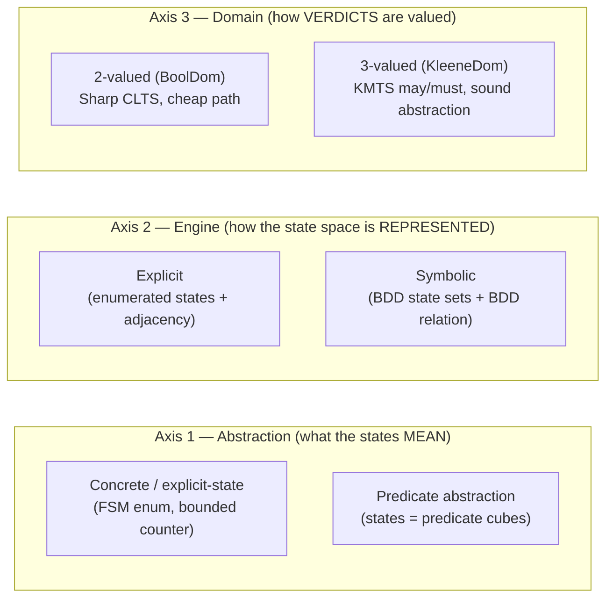

- **Abstraction** is chosen by the adapter/sidecar (explicit enum vs predicate cube).
- **Engine** is chosen by scale: explicit is fine until `2^|P|` blows up, then symbolic.
- **Domain** is chosen by soundness need: 2-valued for exact/Sharp models, 3-valued
  (Kleene) whenever the abstraction carries a may/must split.

R-F5 fills in the **Symbolic** cell of Axis 2 — now shipped alongside the other cells,
selectable per run via `--engine symbolic`.

---

## 2. End-to-end pipeline

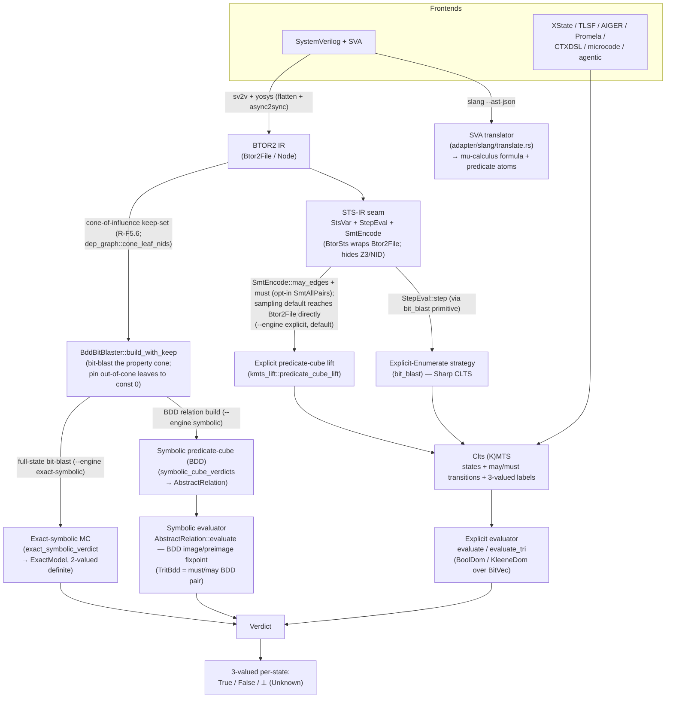

**Reading the diagram.**
- Non-SV frontends build a `Clts` directly and always use the explicit evaluator.
- The SV frontend forks: the **SVA translator** produces the *property* (a mu-calculus
  formula); the **sv2v→yosys→BTOR2** path produces the *model* (yosys *flattens* +
  `async2sync`; the separate `SvModuleHierarchy` discovery pass is the "no-flatten" one).
- **Four** engine strategies consume the model: explicit-enumerate, explicit
  predicate-cube (`--engine explicit`, default), symbolic predicate-cube
  (`--engine symbolic`), and full-state exact-symbolic (`--engine exact-symbolic`,
  `sv verify-auto` only — 2-valued definite, never ⊥).
- **STS-IR seam adoption is partial (as-built, 2026-07-05 AR audit).** The seam
  (`BtorSts`) is the canonical waist for the opt-in `SmtAllPairs`/compound/derived
  slice + register-name resolution, but the *default* sampling cube path and both BDD
  engines (symbolic + exact) reach `Btor2File`/z3 directly. The single-de-duplicated-
  predicate-image goal is not yet met — see `measurements/AR-architecture-review.md`
  (the "full seam adoption" NO-GO-for-now item). #242 (a frozen register from two
  drifting symbol-resolution paths) was a symptom.
- The live symbolic evaluator is `AbstractRelation::evaluate`;
  `SymbolicKmts::evaluate` (§5) is the R-F5.0 spike / general-CLTS path, validated
  against `evaluate_tri` but not on a production caller.
- All paths converge on the same verdict vocabulary (2-valued for exact/Sharp;
  3-valued Kleene for the abstraction paths).

---

## 2b. Operation modes — the path per `--engine`

`sv verify-auto` exposes three engines via `--engine {explicit | symbolic | exact-symbolic}`
(default `explicit`), plus the general `context eval` KMTS path for non-verify-auto adapters.
Each is a different route from the same BTOR2 model to a verdict; this section draws the parts
each one exercises. **Two dimensions distinguish them:** the *abstraction* (full concrete state
vs a predicate cube) and the *engine representation* (explicit vs BDD).

| CLI | Abstraction | Representation | Domain | Cone-of-influence | Refines? | Entry point |
|---|---|---|---|---|---|---|
| `--engine exact-symbolic` | **full concrete state** (bit-blast) | BDD (ROBDD) | 2-valued (definite) | ✅ R-F5.6 | no (exact) | `exact_symbolic_verdict` |
| `--engine symbolic` | **predicate cube** | BDD relation | 3-valued (Kleene) | ✅ R-F5.6 | yes (symbolic CEGAR) | `symbolic_cube_verdicts` |
| `--engine explicit` *(default)* | **predicate cube** | explicit KMTS (2^\|P\| states) | 3-valued (Kleene) | via cluster COI | yes (WP/interpolant CEGAR) | `cegar_refine_loop` |
| `context eval` | adapter-chosen (enum / KMTS lift) | explicit `Clts` | 2- or 3-valued | — | no | `evaluate` / `evaluate_tri` |

### Mode A — `--engine exact-symbolic` (full-state bit-blast, "bitblast")

No predicate abstraction: the engine bit-blasts the whole (cone-restricted) state and decides
the μ-calculus **exactly** over a ROBDD of the concrete state. 2-valued — it never returns `⊥`.

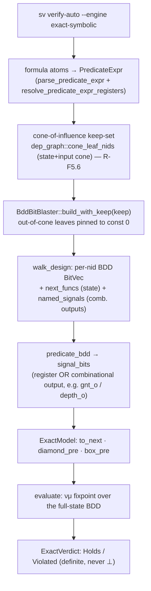

- **Cone-of-influence (R-F5.6)** is what makes this tractable on real designs: the 40-bit blast
  cap counts only the *property cone's* register+input bits. On the differential-oracle corpus
  this took bit-cap-⊥ from 9 designs to 0.
- **Combinational-atom binding** (`named_signals` / `signal_bits`) lets a property target a
  combinational output (`gnt_o`, `depth_o`) whose backing register was optimized away by yosys.

### Mode B — `--engine symbolic` (predicate-cube, BDD relation)

Predicate abstraction, but the abstract relation is a **BDD** (`R_may`/`R_must`), built once —
avoiding the `O(2^{2|P|})` per-cube-pair SMT. 3-valued; a `⊥` cube drives symbolic CEGAR.

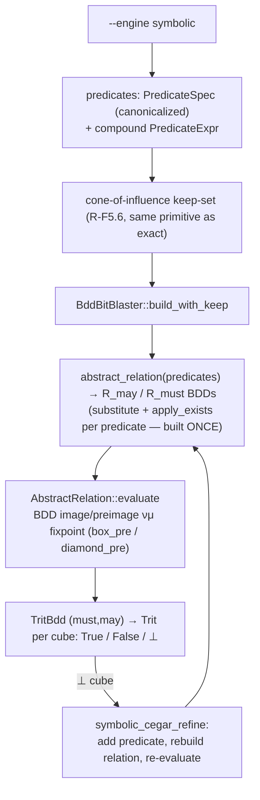

### Mode C — `--engine explicit` (default; predicate-cube, explicit KMTS)

Predicate abstraction with the **explicit** KMTS: materialise `2^|P|` cube states + may/must
adjacency, evaluate with `evaluate_tri`. The workhorse default; CEGAR splits cubes on `⊥`.

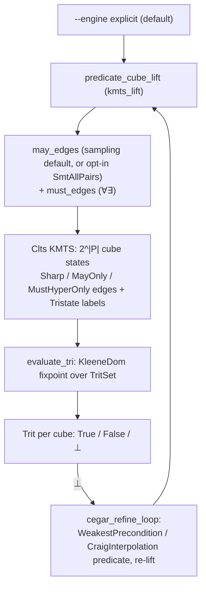

### Mode D — `context eval` (KMTS lifter → KleeneDomain; general adapters)

The non-verify-auto path: any adapter builds a `Clts` (directly, or the SV KMTS lifter turns
BTOR2 into a KMTS with `state_3valued_predicates`), then the evaluator decides. This is the
`context eval --adapter … --formula …` surface — 2-valued for a Sharp CLTS, 3-valued Kleene
when the model carries a may/must split.

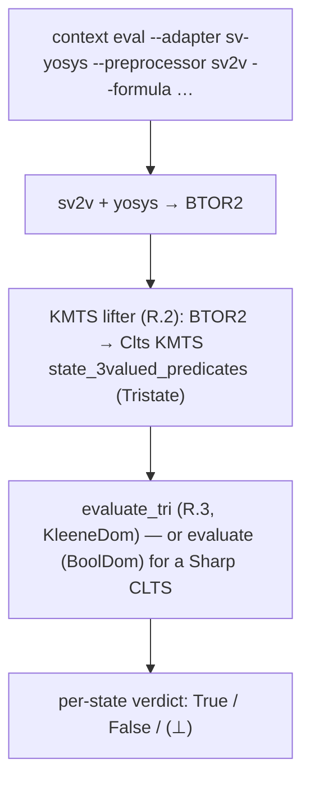

**Choosing a mode.** Exact-symbolic is the sharpest (definite verdicts, no `⊥`) but bounded by
the cone's bit-width; the two predicate-cube engines trade exactness for scale (a `⊥` when the
predicates are too coarse, refined by CEGAR). Symbolic vs explicit is a representation choice at
the same abstraction — pick symbolic when `2^|P|` cube enumeration is the bottleneck (§5).

---

## 3. The IR structs — where they fall and what they look like

The IR is layered. Each layer hides the one below and is consumed by the one above.

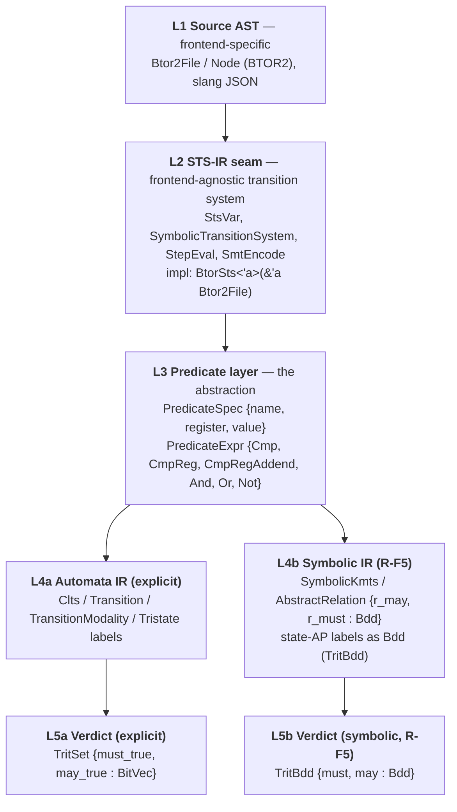

### L2 — STS-IR seam (the narrow waist)

`adapter/sts_ir.rs`. Decouples the abstraction engines from BTOR2/Z3. See
[`docs/design/sts-ir.md`](sts-ir.md).

```rust
pub struct StsVar { pub name: String, pub width: u32 }

pub trait SymbolicTransitionSystem {
    fn state_vars(&self) -> Vec<StsVar>;
    fn input_vars(&self) -> Vec<StsVar>;
}

// Concrete one-step — the Explicit-Enumerate strategy needs only this.
pub trait StepEval: SymbolicTransitionSystem {
    fn step(&self, state: &HashMap<String,u128>, inputs: &HashMap<String,u128>)
        -> Result<HashMap<String,u128>, AdapterError>;
}

// SMT predicate-image — the predicate-cube strategy (and R-F5's relation builder) need this.
pub trait SmtEncode: SymbolicTransitionSystem {
    fn may_edges(&self, predicates: &[PredicateSpec], timeout_ms: u32) -> Vec<(usize,usize)>;
    // must-relation (∀∀ / ∀∃ / hyper-must) follows the same shape.
}
```

`BtorSts<'a>(&'a Btor2File)` implements all three by delegation; `Btor2File`, `Nid`, and
`z3::*` never escape it. **This is the seam R-F5's symbolic relation-builder plugs into
(R-F5.3) — it is not a new frontend.**

### L3 — Predicate layer

A predicate is a boolean function of the concrete registers. Two shapes:

```rust
// The simple cube-dimension form the lift and refinement pass around.
pub struct PredicateSpec { pub name: String, pub register: String, pub value: u64 } // register == value

// The full expression form (compounds / relational / arithmetic-addend).
pub enum PredicateExpr {
    Cmp        { register: String, op: CmpOp, value: u64 },          // reg <op> literal
    CmpReg     { lhs: String, op: CmpOp, rhs: String },              // reg <op> reg   (e.g. $stable, monotonicity)
    CmpRegAddend { lhs: String, op: CmpOp, rhs: String, addend: u64, width: u32 }, // reg <op> reg+const (mod 2^w)
    And(Box<PredicateExpr>, Box<PredicateExpr>),
    Or (Box<PredicateExpr>, Box<PredicateExpr>),
    Not(Box<PredicateExpr>),
}
```

Each predicate becomes **one cube dimension** (one bit). The abstract state space is the
set of predicate *cubes* = valuations of `P` = `{p_0, …, p_{|P|-1}}`.

### L4a — Automata IR (`Clts`, the (K)MTS)

The one data model the explicit evaluator reads. A **CLTS is a degenerate KMTS** where
every transition is `Sharp` and every AP label is definite.

```rust
pub enum TransitionModality<S> {
    Sharp,                                   // in BOTH may and must  (must ⊆ may)
    MayOnly,                                 // in may only  (over-approximation edge)
    MustHyperOnly(Box<SmallVec<[StateId<S>;4]>>), // GKMTS hyper-must: must reach SOME target in the set
}

pub enum Tristate { KleeneT, KleeneF, KleeneBot }  // per-(state, AP) 3-valued label
// Clts stores: state_names, outgoing/incoming adjacency of Transition{target, labels, modality},
//              and state_3valued_predicates: Option<BTreeMap<(StateId, String), Tristate>>.
```

### L4b / L5b — Symbolic IR (R-F5)

The BDD twin of L4a/L5a. State sets and the transition relation are OxiDD BDDs over the
predicate-bit variables (present `x` and next `x'`):

```rust
// A 3-valued state set (the symbolic TritSet): a pair of BDDs over present vars, must ⊑ may.
// (mu_calculus/symbolic.rs) — bridges losslessly to/from the explicit TritSet.
struct TritBdd { must: BDDFunction, may: BDDFunction }

// The symbolic KMTS built from a Clts: the may/must relation + AP labels as BDDs.
// (mu_calculus/symbolic.rs) — SymbolicKmts::from_clts / ::evaluate.
struct SymbolicKmts { /* r_may, r_must, per-label edges + state-var BDDs */ }

// The BTOR2-derived abstract relation, built directly by the BDD bit-blaster
// (adapter/btor2/symbolic_bitblast.rs::BddBitBlaster::abstract_relation).
struct AbstractRelation { /* r_may, r_must : BDDFunction over present+next preds */ }
```

`R_must ⊆ R_may` mirrors `Sharp ⊆ may`; a hyper-must is a disjunction over its target set.
`SymbolicKmts` is the general path (any `Clts`); `AbstractRelation` is the BTOR2
predicate-cube path that builds the relation once, without per-cube-pair SMT (§5).

### L5a — Verdict (`TritSet`)

```rust
pub struct TritSet { must_true: BitVec, may_true: BitVec } // invariant must_true ⊆ may_true
pub enum Trit { True, False, Unknown }                     // verdict_at(state)
```

`Trit` (evaluator output) and `Tristate` (CLTS label) are the same algebra under two
names; conversion is lossless. Post-R-F5, `TritBdd` is the symbolic counterpart of
`TritSet` and yields the same `Trit` at any state (by evaluating the BDD at that state's
minterm).

---

## 4. Predicate abstraction

Predicate abstraction replaces the concrete state (a valuation of the RTL registers) with
a **cube**: a valuation of a chosen predicate set `P`. `|P|` bits ⇒ up to `2^|P|` abstract
states, regardless of how wide the concrete registers are.

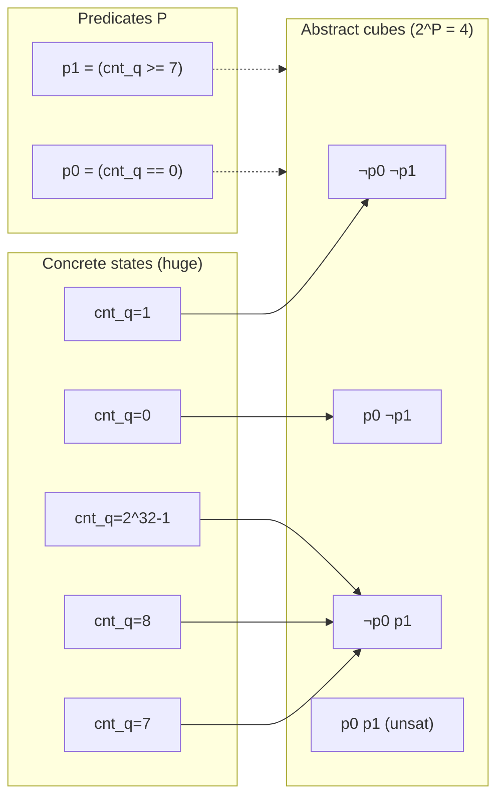

- Concrete states collapse into the cube whose predicate valuation they satisfy
  (`cnt_q=7,8,…` all fall into `¬p0 ∧ p1`).
- The abstraction is **exactly as fine as the predicate set**. Coarse `P` ⇒ few cubes but
  many `⊥`; adding a predicate (a CEGAR refinement, or a seeded bound / threshold) splits
  cubes and can turn `⊥` into a definite verdict.
- Predicates come from: the property's atoms, sidecar declarations, config concretization
  (H.J), counter bounds/thresholds (H.H), and CEGAR (`PredicateSource::{WeakestPrecondition,
  CraigInterpolation}`).

The abstract **transition relation** over cubes is where the two engines differ (§5), and
where the may/must split lives (§6).

---

## 5. Explicit vs symbolic model checking

Both engines evaluate the *same* mu-calculus formula over the *same* abstract semantics.
They differ only in how the state space + relation are represented and how the fixpoint is
computed.

```mermaid
flowchart TB
  subgraph EX["Explicit engine (shipped)"]
    ex1["Materialise 2^P cube states (Clts)"]
    ex2["Build may/must edges:<br/>SmtEncode — O(2^2P) Z3 queries"]
    ex3["Fixpoint: for each state, walk outgoing<br/>transitions (modal_bits_from_target)"]
    ex4["Verdict: TritSet (must/may BitVec)"]
    ex1 --> ex2 --> ex3 --> ex4
  end
  subgraph SY["Symbolic engine (R-F5, shipped)"]
    sy0["Cone-of-influence restriction (R-F5.6)<br/>build_with_keep — bit-blast only the property cone"]
    sy1["No cube enumeration — vars = predicate bits"]
    sy2["Build R_may / R_must as BDDs<br/>(BddBitBlaster, from BTOR2, once — not per pair)"]
    sy3["Fixpoint: BDD image/preimage<br/>∃x'. R(x,x') ∧ φ(x')  via apply_exists(And,…)"]
    sy4["Verdict: TritBdd (must/may BDD)"]
    sy0 --> sy1 --> sy2 --> sy3 --> sy4
  end
```

| | Explicit | Symbolic (R-F5) |
|---|---|---|
| Abstract state | one `Clts` state per cube (index `0..2^|P|`) | a minterm over `|P|` BDD vars |
| State *set* | `BitVec` of `2^|P|` bits | one BDD |
| Transition relation | adjacency lists (`Transition{target,modality}`) | `R_may` / `R_must` BDDs over `x`,`x'` |
| Edge construction | **`O(2^2|P|)` SMT** (`SmtAllPairs`) ← the bottleneck | build R once (R-F5.3) |
| Modal step | `for state … for transition …` | `apply_exists(And, φ[x'], x'-cube)` |
| Verdict | `TritSet` | `TritBdd` |
| Best when | small `|P|`, or explicit enum models | large `|P|` (predicate cube blows up) |

**Why symbolic is not "just a smaller verdict."** The verdict `BitVec` was never the
problem — a 4096-cube verdict is ~512 bytes. The cost is (a) enumerating `2^|P|` cube
states and (b) the `O(2^2|P|)` per-cube-pair SMT to build the relation. The symbolic
engine removes both: the relation is one BDD, and the fixpoint operates on BDD-encoded
sets without touching individual cubes. The `evaluate_tri` evaluator stays the ground
truth — the symbolic path is validated cell-for-cell against it (R-F5.0 spike).

### The shared modal semantics (both engines)

The 3-valued box/diamond is the Bruns–Godefroid semantics
(`evaluator::modal_trit_core`, and the symbolic `box_pre` in `mu_calculus/symbolic.rs`):

```text
[a]φ  must  =  ∀ may-successors.  φ.must      ( box.must = ¬∃x'. R_may  ∧ ¬φ.must[x'] )
[a]φ  may   =  ∀ must-successors. φ.may       ( box.may  = ¬∃x'. R_must ∧ ¬φ.may[x']  )
<a>φ  must  =  ∃ must-successors. φ.must      ( dia.must =  ∃x'. R_must ∧  φ.must[x']  )
<a>φ  may   =  ∃ may-successors.  φ.may       ( dia.may  =  ∃x'. R_may  ∧  φ.may[x']   )
```

The right column is the symbolic form; the left is the explicit form. They compute the
same function — the spike proves it.

---

## 6. Over / under / bottom approximation and may/must edges

### The two lattices

The 3-valued Kleene domain carries **two** orders over `{True, ⊥, False}`:

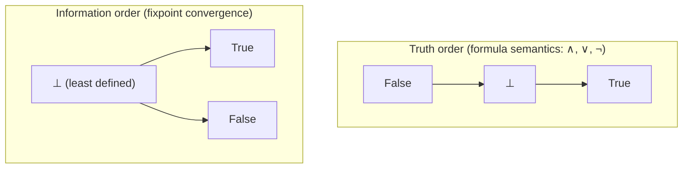

- **Truth order** `False < ⊥ < True` drives `∧`/`∨`/`¬` (`⊥ ∨ True = True`, `⊥ ∧ False =
  False`, `⊥ ∧ True = ⊥`).
- **Information order** `⊥ < {True, False}` (True/False incomparable) drives fixpoint
  convergence — iterating makes the verdict *more defined*. In `BoolDom` these two orders
  coincide (which is why the 2-valued path never notices the distinction).

### may / must edges = over / under approximation

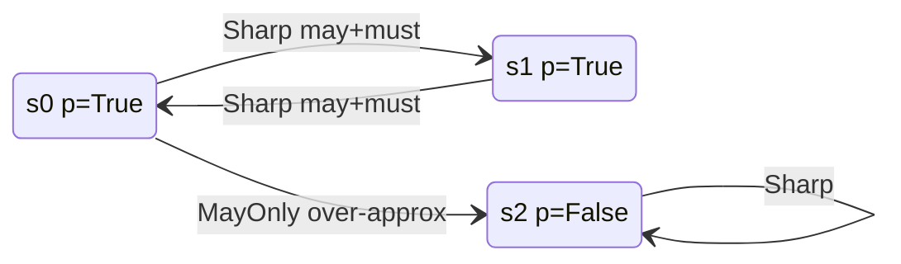

- **`R_may` (over-approximation).** Every concrete transition is admitted, plus possibly
  spurious ones. `(b,b') ∈ R_may ⟺ ∃ s⊨b, s'⊨b'. (s,s')∈R`. Used for the **upper** bound
  of a verdict (the `may` side).
- **`R_must` (under-approximation).** Only transitions guaranteed to exist. `(b,b') ∈
  R_must ⟺ ∀ s⊨b. ∃ s'⊨b'. (s,s')∈R`, with `R_must ⊆ R_may`. Used for the **lower** bound
  (the `must` side).
- **`MayOnly`** = a may-edge with no must-witness (a *pure over-approximation* edge). It
  can only push a verdict toward `⊥`, never fabricate a definite one.
- **`MustHyperOnly {targets}`** = GKMTS hyper-must: the transition must reach *some* target
  in the set (needed for sound refinement of alternating fixpoints).
- **`⊥` (bottom)** is the *verdict*, not an edge kind: it is what the evaluator returns
  when the may-relation admits a behaviour the must-relation cannot confirm — "the
  abstraction is too coarse to decide," never "violated."

In the example above, `νX.(p ∧ []X)` (= `AG p`) gives:
- **Sharp-only** (drop the `MayOnly` edge): `s0,s1 = True`, `s2 = False` — a definite AGp on
  the p-true cycle.
- **With the `MayOnly` edge** `s0→s2`: the box at `s0` sees a may-successor (`s2`) with
  `p=False` and no must-witness → `s0 = ⊥`; the cycle propagates `⊥` to `s1`; `s2 = False`.
  This is the may/must split — the reason the domain is 3-valued.

### Which verdicts transfer to the concrete system (soundness)

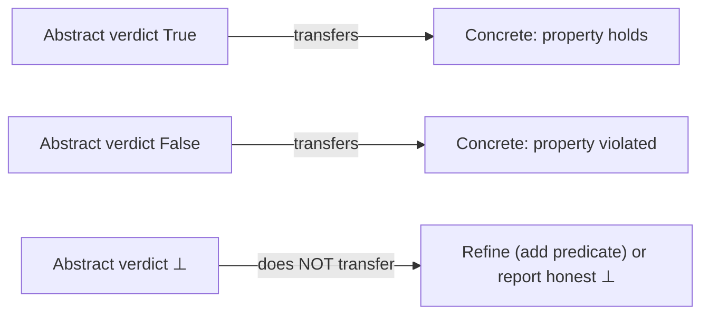

By the Bruns–Godefroid preservation theorem, **definite** abstract verdicts (`True`,
`False`) transfer to the concrete system at every alternation depth — *because* the
KMTS carries both `R_may` and `R_must`. A single over-approximation (may only) would be
sound for safety/`ν` but not for liveness/`μ`; the may/must pair is what makes definite
verdicts sound for the full mu-calculus. `⊥` is the only non-transferring verdict, and it
is honest — it drives CEGAR refinement, never a false claim.

This soundness argument is **representation-independent**: it is a property of the may/must
semantics, so it holds identically for the explicit (`TritSet`) and symbolic (`TritBdd`)
engines. Swapping the engine changes cost, not correctness.

---

## 7. What is shipped vs planned

```mermaid
flowchart LR
  subgraph SHIP["Shipped (R-F5.0 – .5)"]
    d1["STS-IR seam (StsVar / StepEval / SmtEncode / BtorSts)"]
    d2["Predicate layer (PredicateSpec / PredicateExpr)"]
    d3["Explicit engines: Enumerate + predicate-cube lift"]
    d4["Clts KMTS (Sharp / MayOnly / MustHyperOnly + Tristate)"]
    d5["Explicit evaluator (BoolDom / KleeneDom, TritSet)"]
    d6["R-F5.0–.2 symbolic engine: SymbolicContext / TritBdd /<br/>SymbolicKmts — BDD image/preimage νμ fixpoint,<br/>validated cell-for-cell vs evaluate_tri"]
    d7["R-F5.2b guarded modalities (label + current/next state)"]
    d8["R-F5.3 symbolic R_may/R_must from BTOR2<br/>(BddBitBlaster → AbstractRelation, built once — not per pair)"]
    d9["R-F5.4 --engine symbolic on btor2/sv cegar (CLI + API)"]
    d10["R-F5.5 symbolic CEGAR loop + verify-auto wiring +<br/>compound-predicate cube dims"]
    d11["R-F5.6 cone-of-influence on BOTH bit-blasters<br/>(build_with_keep + cone_leaf_nids)"]
    d12["Bit-blaster op completeness (Mul / shifts / signed) +<br/>combinational-atom binding (named_signals)"]
  end
  subgraph PLAN["Remaining (R-F5 close-out → default-flip)"]
    p1["BDD variable ordering (push the cone cap higher generally)"]
    p2["cegar-vs-symbolic verdict parity → make --engine symbolic the default"]
    p3["Out-of-fragment over cubes (honest errors, not planned):<br/>controllability (ctrl) + step-bounded (steps) modalities;<br/>MustHyperOnly edges on the symbolic path"]
  end
  SHIP --> PLAN
```

**What shipped (R-F5.0–.5).** The symbolic engine is selectable via `--engine symbolic`
on `btor2 cegar`, `sv cegar`, and `sv verify-auto` (CLI + API). It bit-blasts the BTOR2
design to BDDs (`BddBitBlaster`), builds `R_may`/`R_must` as an `AbstractRelation`
**once** — a single `substitute` + `apply_exists` per predicate, the
`O(2^2|P|)`-SMT-avoidance win, no per-cube-pair SMT — and evaluates the mu-calculus by
BDD image/preimage in `SymbolicKmts`. Every symbolic verdict is validated cell-for-cell
against the explicit `evaluate_tri` in the test suite, including nested νμ and guarded
modalities. This resolved the R-F5.0 spike's open question — the spike validated the
*evaluation* side (given a symbolic relation) and R-F5.3 delivered the *construction*
side via BDD bit-blasting.

**R-F5.6 cone-of-influence has shipped (2026-07-05).** `BddBitBlaster::build_with_keep` pins
out-of-cone leaves to constants so each engine bit-blasts only the property's cone
(`dep_graph::cone_leaf_nids`), lifting the 40-bit cap on real designs — both the exact and the
symbolic engines wire it (`exact_symbolic_verdict`, `symbolic_cube_verdicts`). Bit-blaster op
completeness (`Mul` shift-and-add, `Sll`/`Srl`/`Sra` barrel shifter, signed `Slt`/`Sgt`/…) and
combinational-atom binding (`named_signals` — bind a predicate to a combinational output whose
register yosys optimized away) landed alongside. On the 15-module OpenTitan corpus the census
went from True=3/False=4/⊥=9 to True=9/False=7/⊥=0.

**Remaining (the R-F5 close-out → default-flip).** BDD **variable ordering** (push the cone cap
higher for still-wide cones generally) and **cegar-vs-symbolic verdict parity** across the full
suite, which together gate making `--engine symbolic` the default. Independently, controllability
(`ctrl`) and step-bounded (`steps`) modalities, and `MustHyperOnly` edges on the symbolic path,
are **honest errors** (out of the predicate-cube fragment) rather than planned features — see
`mu_calculus/symbolic.rs`.

---

## 8. Cross-references

- [`docs/design/sts-ir.md`](sts-ir.md) — the STS-IR seam (L2).
- [`docs/design/kmts-theory.md`](kmts-theory.md) — KMTS + 3-valued mu-calculus theory.
- [`docs/design/native-sv-abstraction.md`](native-sv-abstraction.md) — the SV predicate-
  abstraction pipeline (§6 KMTS recipe, §6.10 UF abstraction).
- [`docs/abstraction.md`](../abstraction.md) — per-subsystem abstraction recipe.
- `crates/mununu-core/src/mu_calculus/symbolic.rs` — `SymbolicContext` / `TritBdd` /
  `SymbolicKmts` (the BDD engine + symbolic mu-calculus evaluator).
- `crates/mununu-core/src/adapter/btor2/symbolic_bitblast.rs` — `BddBitBlaster` /
  `AbstractRelation` (symbolic `R_may`/`R_must` from BTOR2, built once).
- `crates/mununu-core/src/adapter/btor2/symbolic_engine.rs` — `symbolic_cube_verdicts`
  / `symbolic_cegar_refine` (the symbolic predicate-cube + CEGAR entry points).
- `crates/mununu-core/src/mu_calculus/trit.rs` — `Trit` / `TritSet`.
- `crates/mununu-core/src/clts/mod.rs` — `Clts` / `Transition` / `TransitionModality` /
  `Tristate`.
- `crates/mununu-core/src/adapter/btor2/kmts_lift.rs` — `predicate_cube_lift`,
  `MayEdgeInference` / `MustEdgeInference`.
