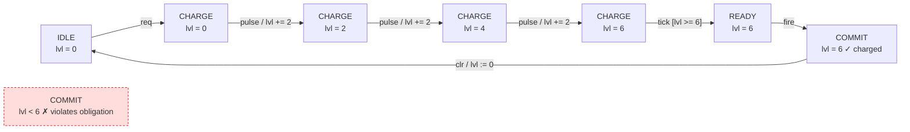
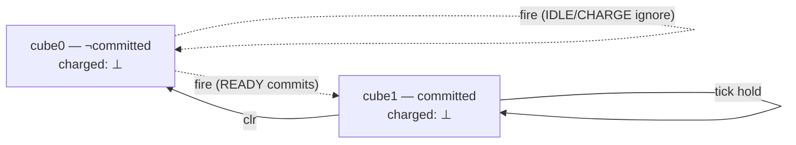
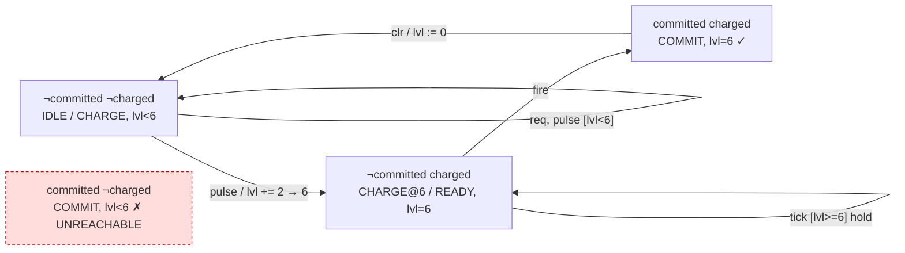
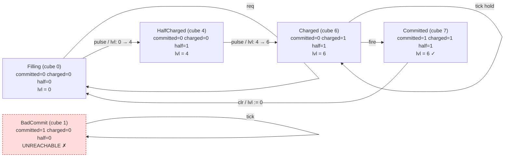

# Predicate Abstraction, End to End — A Worked Example

> **Status: planning** until R.5 ships. This is the *worked-example* companion to
> [`predicate-abstraction-recipe.md`](predicate-abstraction-recipe.md) (the
> operational reference) and [`kmts-theory.md`](kmts-theory.md) (the theory). It
> carries one small SystemVerilog module — a controller with a real **arithmetic
> datapath** — the whole length of the pipeline: RTL → BTOR2 → a coarse predicate
> abstraction that returns `KleeneBot` → a Craig interpolant that supplies the
> missing **arithmetic** predicate → a refined abstraction over **two predicates /
> a multi-bit cube** that returns a definite, transferable verdict. Sections that
> reference live code carry inline anchors; per the recipe doc's convention they do
> not graduate to `> Source of truth:` until the corresponding R.5 phase ships.
> Where the shipped MVP differs from the construction described here, an
> **Implementation status** note marks the gap.
>
> **Every source artifact in this doc is verified against an actual binary** (per
> the repo's Claims Integrity policy):
>
> | artifact | file | binary | what runs |
> |---|---|---|---|
> | RTL | [`charge_commit.sv`](../../examples/hw/charge_commit.sv) | **Verilator 5.043** | compile + 20 000-cycle randomized sim, `--assert` on; negative control fails (§1.2) |
> | RTL → BTOR2 | [`charge_commit_to_btor2.ys`](../../examples/hw/charge_commit_to_btor2.ys) | **yosys 0.59** | `write_btor` emits a real `bad`; output is [`charge_commit.yosys.btor2`](../../examples/hw/charge_commit.yosys.btor2) (§2.1) |
> | BTOR2 (readable mirror) | [`charge_commit.btor2`](../../examples/hw/charge_commit.btor2) | **mununu** | `mununu btor2 cegar` (§7) |
> | cube automaton | [`charge_commit_cubes.ctxdsl`](../../examples/hw/charge_commit_cubes.ctxdsl) | **mununu** | `mununu context eval`, four formulas (§6.4) |
>
> The one step that does **not** run on this machine is **Craig interpolation in
> §4**: cvc5 is an optional external tool and is absent here, so the loop falls
> back to the WP heuristic (real warning captured in §7). The cvc5 transcript in §4
> is therefore the *construction the theory specifies*, not a run; everything else
> is captured verbatim. The clean `KleeneBot → interpolant → KleeneT` arc of §3–§5
> is likewise the construction; §7 shows the more modest output the MVP loop emits
> today (1-iteration convergence).

## Why this doc exists

The recipe doc explains *which* predicate-image query to run and *where*
predicates come from. The theory doc proves *why* the verdicts transfer. Neither
walks a single concrete artifact from RTL to verdict with the cubes, the
may/must edges, the three-valued fixpoint, and the interpolant all written out.
That gap is what makes predicate abstraction feel like magic to a newcomer and
what makes a `KleeneBot` verdict hard to debug. This doc closes it on an example
small enough to evaluate by hand, with an arithmetic datapath so the interesting
predicate is a *comparison* (`lvl >= 6`) the abstraction has to discover — not
just an FSM-state equality. It is the concrete instance
[`docs/abstraction.md`](../abstraction.md) points at: a design whose datapath is
too wide to enumerate, so the verdict must survive **abstraction**.

### Definitions used below (and where they come from)

This example is an instance of four pieces of established theory; the
[reading list](#reading-list--literature) at the end gives full citations.

- **Predicate abstraction** (Graf & Saidi, CAV 1997). Given a concrete system and
  a finite predicate set `P = {p₁,…,p_k}`, the abstract states are *cubes* —
  Boolean valuations over `P` — and each cube `b` concretizes to
  `γ(b) = { s : ∀ pᵢ. b(pᵢ) = pᵢ(s) }`. There are at most `2^k` cubes; here `k`
  grows from 1 (§3) to 2 (§5) to 3 (§6), so the cube is genuinely **multi-bit**.
- **KMTS / may–must abstraction** (Larsen & Thomsen 1988; Godefroid–Huth–Jagadeesan
  CONCUR 2001 for the predicate-abstraction reading). A predicate abstraction is
  naturally a *Kripke Modal Transition System*: `R_may(b,b') ⟺ ∃ s∈γ(b),s'∈γ(b'). (s,s')∈R`
  (an over-approximating edge) and `R_must(b,b') ⟺ ∀ s∈γ(b). ∃ s'∈γ(b'). (s,s')∈R`
  (an under-approximating edge), with `R_must ⊆ R_may`.
- **Three-valued model checking** (Bruns & Godefroid, CONCUR 2000). The modal-mu
  calculus is evaluated over the Kleene domain `{T, F, ⊥}`; **definite** verdicts
  (`T`/`F`) transfer to the concrete system at *every* alternation depth, and a `⊥`
  triggers refinement.
- **CEGAR by interpolation** (Clarke–Grumberg–Jha–Lu–Veith, CAV 2000; Craig 1957;
  McMillan, CAV 2003). A `⊥`/spurious-counterexample is discharged against the
  concrete transition relation; the UNSAT proof yields a Craig **interpolant** that
  becomes the next predicate. Here that interpolant is the arithmetic comparison
  `lvl >= 6` (§4).

## The pipeline at a glance

```
  charge_commit.sv      (1) RTL: a controller with a charge-level datapath
       │  extract / lower  (mununu-extract → BTOR2)
       ▼
  charge_commit.btor2   (2) bit-level transition relation  (add, ugte, …)
       │  predicate_cube_lift   with P0 = { committed }   (under-seeded)
       ▼
  coarse KMTS (2 cubes) (3) over-approximation: datapath collapsed, charged = ⊥
       │  3-valued evaluation   νX.( [fire] charged ∧ [] X )
       ▼
  verdict = KleeneBot   (3') indefinite — abstraction can't see the level
       │  CEGAR: failure subgame → cvc5 get-interpolant
       ▼
  interpolant: lvl >= 6 (4) the missing ARITHMETIC predicate
       │  predicate_cube_lift   with P1 = { committed, charged }
       ▼
  refined KMTS (4 cubes) (5) finer over-approximation, datapath partitioned
       │  3-valued evaluation
       ▼
  verdict = KleeneT      (5') definite — transfers to the real RTL (safety + over-approx)
       │  add a third predicate `half = lvl>=4`; materialize the cubes as CTXDSL
       ▼
  runnable CTXDSL       (6) 3-bit cube automaton — verified live by `mununu context eval`
```

CTXDSL μ-calculus syntax used below: `[] φ` is the box over **all** actions,
`<> φ` the diamond, `[ labels = { a } ] φ` a label-restricted box, `mu`/`nu` the
fixpoints, `&&`/`||`/`!` the connectives, and a bare state name is the atomic
proposition "in that state."

The load-bearing idea: a single abstraction direction (over-approximation) makes
**safety** verdicts sound, but only if the abstraction is *precise enough* to
avoid a spurious counterexample. With a datapath, "precise enough" means tracking
the right arithmetic fact. Interpolation is how the loop discovers that fact
without enumerating 2⁸ (read: 2³²) level values.

## §1 — The RTL

A command/commit controller that must **charge up** before it may commit. It
walks four phases — `IDLE → CHARGE → READY → COMMIT` — accumulating a level
`lvl` while charging (`lvl += 2` per `pulse`), and only advancing to `READY` once
`lvl >= 6`. The safety obligation: **it may only commit (`fire`) while charged**,
i.e. `commit_en` never rises with `lvl < 6`.

The module is the committed file
[`examples/hw/charge_commit.sv`](../../examples/hw/charge_commit.sv) (abridged
below — the committed file additionally carries the obligation as a `FORMAL`-gated
immediate assertion that both Verilator and yosys consume, §1.2 / §2.1):

```systemverilog
// charge_commit.sv  (abridged — see the committed file for the FORMAL assertion)
module charge_commit (
    input  logic       clk,
    input  logic       rst,
    input  logic       req,     // environment: a request arrives
    input  logic       pulse,   // environment: a charge pulse
    input  logic       fire,    // controller: open the commit window
    input  logic       clr,     // environment: release
    output logic       commit_en
);
    typedef enum logic [1:0] { IDLE=2'd0, CHARGE=2'd1, READY=2'd2, COMMIT=2'd3 } phase_t;
    phase_t     phase;
    logic [7:0] lvl;            // charge level — the arithmetic datapath

    localparam logic [7:0] STEP      = 8'd2;
    localparam logic [7:0] THRESHOLD = 8'd6;

    always_ff @(posedge clk) begin
        if (rst) begin
            phase <= IDLE;
            lvl   <= 8'd0;
        end else begin
            case (phase)
                IDLE  : if (req)               phase <= CHARGE;
                CHARGE: begin
                    if (lvl < THRESHOLD) begin
                        if (pulse) lvl <= lvl + STEP;   // ── arithmetic: accumulate
                    end else begin
                        phase <= READY;                  // ── arithmetic guard: lvl >= 6
                    end
                end
                READY : if (fire)              phase <= COMMIT;
                COMMIT: if (clr) begin phase <= IDLE; lvl <= 8'd0; end
            endcase
        end
    end

    assign commit_en = (phase == COMMIT);
    // Safety obligation:  G ( commit_en -> lvl >= THRESHOLD )
endmodule
```

**The truth of the matter** (which the verifier must *discover*, not be told):
`lvl` only ever takes the values `{0, 2, 4, 6}` — it accumulates by 2 and the
phase leaves `CHARGE` the moment `lvl >= 6`, so it saturates at 6 and is exactly
6 in every reachable `READY` and `COMMIT` state. The obligation **holds**. The
game is proving it without enumerating the 8-bit (→ 32-bit) level.

### Concrete behaviour (values in states, arithmetic on transitions)



The red `COMMIT, lvl < 6` state is what the obligation forbids — and it is
**unreachable**, because the only way into `COMMIT` is `READY --fire--> COMMIT`,
and `READY` is only entered once `lvl >= 6`. (`tick` is the internal label for the
autonomous `CHARGE→READY` step the always_ff takes when the guard holds.)

### §1.2 — Sanity-checking the RTL under Verilator

Before any abstraction, confirm the *concrete* RTL actually satisfies the
obligation. The committed file carries it as a clocked immediate assertion
(`safety_charged: assert (!commit_en || lvl >= THRESHOLD)`, active under `FORMAL`),
and [`charge_commit_tb.sv`](../../examples/hw/charge_commit_tb.sv) drives 20 000
cycles of deterministic xorshift stimulus:

```bash
verilator --binary --assert --timing -DFORMAL -Wall \
  -Wno-DECLFILENAME -Wno-UNUSEDSIGNAL -Wno-PROCASSINIT \
  charge_commit.sv charge_commit_tb.sv --top-module charge_commit_tb -o sim
./obj_dir/sim
```

Captured verbatim (Verilator 5.043, `hw-verif:latest`):

```
charge_commit_tb: 20000 cycles, commit_en asserted in 6168, no assertion failures
- charge_commit_tb.sv:53: Verilog $finish
```

A bounded simulation **cannot prove** the property (it only fails to falsify it in
20 000 cycles) — that is exactly the gap exhaustive abstract model checking fills.
But it is a load-bearing *negative control* for the harness: re-run with a broken
variant in which `CHARGE` advances to `READY` on `req` regardless of `lvl`, and the
assertion fires almost immediately —

```
[85] %Error: charge_commit_broken.sv:56: Assertion failed in ...dut.safety_charged: 'assert' failed.
```

— so the green run above is meaningful, not a vacuous pass.

## §2 — Lower to BTOR2 (extraction)

The frontend lowers `always_ff` to a bit-level relation over two state elements,
`phase` (2-bit) and `lvl` (8-bit). The **arithmetic** is explicit: `add` for the
accumulate, `ugte` / `ult` for the threshold comparisons.

### §2.1 — The real frontend lowering (yosys)

The SV → BTOR2 lowering **is exercised against the actual yosys binary**.
[`charge_commit_to_btor2.ys`](../../examples/hw/charge_commit_to_btor2.ys) reads
the `FORMAL`-gated assertion and lowers it to a BTOR2 `bad` state:

```bash
yosys charge_commit_to_btor2.ys      # write_btor -> charge_commit.yosys.btor2
```

Captured verbatim — the obligation became a real property node, and mununu's CEGAR
loop runs on the yosys output unchanged:

```
21 bad 20 safety_charged ; charge_commit.sv:60.13-60.70
```
```
$ mununu btor2 cegar charge_commit.yosys.btor2 \
    --formula 'nu X. ([] X)' --predicate 'committed:phase=3' --predicate-source wp
CEGAR refinement loop completed
  fixture:           charge_commit.yosys.btor2
  iterations:        1
  terminated_with:   Converged
  final predicates:  1
```

> The generated [`charge_commit.yosys.btor2`](../../examples/hw/charge_commit.yosys.btor2)
> is faithful but verbose (yosys encodes the property with an auxiliary state
> register and `concat`/`redand` mux trees). For the by-hand walkthrough below, §2.2
> uses an equivalent **readable mirror**,
> [`examples/hw/charge_commit.btor2`](../../examples/hw/charge_commit.btor2), whose
> node numbering matches the prose. Both run under `mununu btor2 cegar` (§7); the
> mirror is what the rest of the doc references. Per Claims Integrity, the readable
> mirror demonstrates the lifter/CEGAR *behaviour*, while the yosys output above is
> the evidence the SystemVerilog actually lowers end-to-end.

### §2.2 — The readable BTOR2 mirror

```
; charge_commit.btor2
1  sort bitvec 2          ; phase
2  sort bitvec 8          ; lvl
3  sort bitvec 1          ; bool
; --- phase constants ---
4  constd 1 0             ; IDLE
5  constd 1 1             ; CHARGE
6  constd 1 2             ; READY
7  constd 1 3             ; COMMIT
; --- lvl constants ---
8  constd 2 0
9  constd 2 2             ; STEP
10 constd 2 6             ; THRESHOLD
; --- state + init ---
11 state 1 phase
12 state 2 lvl
13 init  1 11 4           ; phase = IDLE
14 init  2 12 8           ; lvl   = 0
; --- inputs ---
15 input 3 req
16 input 3 pulse
17 input 3 fire
18 input 3 clr
; --- phase predicate atoms ---
19 eq 3 11 5              ; phase == CHARGE
20 eq 3 11 6              ; phase == READY
21 eq 3 11 7              ; phase == COMMIT
22 eq 3 11 4              ; phase == IDLE
; --- ARITHMETIC ---
23 ugte 3 12 10           ; lvl >= 6      (charged)        ◀── comparison
24 ult  3 12 10           ; lvl <  6                        ◀── comparison
25 add  2 12 9            ; lvl + 2                         ◀── accumulate
; --- next(lvl): CHARGE & pulse & lvl<6 ? lvl+2 : (COMMIT & clr ? 0 : lvl) ---
26 and 3 19 16            ; CHARGE & pulse
27 and 3 26 24            ; CHARGE & pulse & lvl<6
28 ite 2 27 25 12         ;   ? lvl+2 : lvl
29 and 3 21 18            ; COMMIT & clr
30 ite 2 29 8 28          ;   ? 0 : prev
31 next 2 12 30
; --- next(phase): IDLE&req->CHARGE; CHARGE&(lvl>=6)->READY; READY&fire->COMMIT; COMMIT&clr->IDLE ---
32 and 3 22 15            ; IDLE & req
33 ite 1 32 5 11          ;   ? CHARGE : phase
34 and 3 19 23            ; CHARGE & (lvl>=6)
35 ite 1 34 6 33          ;   ? READY : prev
36 and 3 20 17            ; READY & fire
37 ite 1 36 7 35          ;   ? COMMIT : prev
38 ite 1 29 4 37          ; COMMIT & clr ? IDLE : prev
39 next 1 11 38
; --- property: bad = COMMIT & ¬(lvl>=6) = commit while undercharged ---
40 not 3 23               ; lvl < 6  (¬charged)
41 and 3 21 40            ; COMMIT & ¬charged
42 bad 41
```

## §3 — Coarse abstraction `P0 = { committed : phase == COMMIT }`

We deliberately **under-seed**: the user supplies only the control predicate and
forgets the datapath. This is the most common reason a real run returns
`KleeneBot`, and exactly the case interpolation is for.

### §3.1 Cubes

One predicate → `2¹ = 2` cubes. Bit-convention (recipe §3, test
[`predicate_cube_lift_state_3valued_predicates_match_cube_bit_pattern`](../../crates/mununu-core/src/adapter/btor2/kmts_lift.rs)):
predicate at bit `i` is true in cube `c` iff `(c >> i) & 1 == 1`.

| cube | index | `committed` (bit 0) | concretization γ |
|------|-------|---------------------|------------------|
| `cube0` | 0 | F | every state with `phase ≠ COMMIT`, **any `lvl`** |
| `cube1` | 1 | T | `phase == COMMIT`, **any `lvl`** |

`lvl` is invisible: each cube spans all 256 level values.

### §3.2 CLTS (CTXDSL surface, with labels)

The transitions carry the real event labels and controllability is declared. This
block is a **schematic** of the coarse 2-cube structure: the property's `charged`
AP (`lvl >= 6`) is *not expressible* over `P0` — no state binds it — so this
context illustrates the stall but is not itself runnable. The full, parser-checked,
`mununu context eval`-runnable model is in **§6** (with the `charged` and `half`
predicates added).

```
context ChargeCommitCoarse {                        // schematic — see §6 for the runnable model
    alphabet {
        label req;      // environment: request arrives
        label pulse;    // environment: charge pulse  (carries lvl += 2)
        label fire;     // controller: open the commit window
        label clr;      // environment: release
        label tick;     // internal: autonomous CHARGE -> READY at the threshold
    }

    automata {
        automaton Cubes {
            controllable { label fire; }            // only the controller fires
            internal     { label tick; }            // threshold step is autonomous

            states {
                state cube0 initial {               // ¬committed
                    valuations { committed = 0; }
                };
                state cube1 {                       //  committed
                    valuations { committed = 1; }
                };
            }

            transitions {
                transition cube0 -> cube0 on label req;
                transition cube0 -> cube0 on label pulse;   // lvl += 2, but lvl untracked
                transition cube0 -> cube1 on label fire;     // READY commits — may-only
                transition cube1 -> cube0 on label clr;
                transition cube1 -> cube1 on label tick;     // hold
            }

            predicates {                             // predicates block is automaton-scoped
                predicate committed = state cube1;
                // charged ≡ ⟨lvl >= 6⟩ — NOT bindable over P0; supplied in §6
            }
        }
    }

    mu_formulas {
        // Safety: every `fire` transition lands in a charged state.
        // LABEL-RESTRICTED box guard (CLAUDE.md "Rich modal guards").
        formula commit_only_when_charged {
            over Cubes;
            body = nu X. ( [ labels = { fire } ] charged && [] X );
        }
    }
}
```

> **A realize gotcha worth knowing** (you hit it the moment you make this
> runnable): two transitions with the *same* `(source, label)` but different
> targets collapse to one edge during realize. The coarse model "wants" both
> `cube0 --fire--> cube0` (IDLE/CHARGE ignore `fire`) and `cube0 --fire--> cube1`
> (READY commits) — genuine may-nondeterminism — but a hand-authored CTXDSL CLTS
> keeps one. §6 avoids this by giving each `(source, label)` a single target.

### §3.3 KMTS (what the lifter produces)

The KMTS is that CLTS **plus**
[`TransitionModality`](../../crates/mununu-core/src/clts/mod.rs) per edge —
`Sharp` (in both `may` and `must`) or `MayOnly` (over-approx, no must-witness) —
and [`state_3valued_predicates`](../../crates/mununu-core/src/clts/mod.rs), each
cube's `Tristate` label per *formula* AP (recipe §1.2). The formula's AP is
`charged ≡ lvl >= 6`; with `lvl` untracked, **`charged` is `KleeneBot` in every
cube**.



| from | to | label | may | must | modality |
|------|----|-------|:---:|:----:|----------|
| cube0 | cube0 | req,pulse,tick | ✓ | ✗ | `MayOnly` |
| cube0 | cube0 | fire | ✓ | ✗ | `MayOnly` — `IDLE`/`CHARGE` ignore `fire` and self-loop |
| cube0 | cube1 | fire | ✓ | ✗ | `MayOnly` — only `READY` states actually commit ⇒ `fire` is not *must* into either target |
| cube1 | cube0 | clr | ✓ | ✓ | `Sharp` |
| cube1 | cube1 | tick | ✓ | ✓ | `Sharp` |

### §3.4 Three-valued evaluation of `νX. ( [fire] charged ∧ [] X )`

Box over a KMTS (Bruns–Godefroid; kmts-theory §2):
`⟦[L]φ⟧(s) = T` iff **all** `L`-labelled *may*-successors satisfy `φ = T`;
`= F` iff **some** `L`-labelled *must*-successor has `φ = F`; otherwise `⊥`.

```
[fire] charged  at cube0 :
    fire-may-successors = { cube0, cube1 };  charged = ⊥ in both  ⇒ box ≠ T
    fire-must-successors = ∅ (both fire edges are MayOnly)         ⇒ box ≠ F
    ⇒ [fire] charged = ⊥
νX : X(cube0) = ⊥ ∧ [] X = ⊥
```

**Verdict at the initial cube `cube0` = `KleeneBot`.** The abstraction cannot
decide the obligation: it can see a `fire` edge into `committed`, but with the
level collapsed it cannot tell whether the post-`fire` state is charged. This is
the `KleeneBot → CEGAR` trigger
[`cegar_refine_loop`](../../crates/mununu-core/src/adapter/btor2/cegar.rs)
responds to.

> **Implementation status.** The `KleeneBot` verdict above is the verdict of the
> *exact* construction — it is **not** what the MVP loop emits on this fixture.
> mununu's R.2.5 `predicate_cube_lift` emits `MayOnly` edges by **sampling one
> representative per cube** and simulating one step (a sound under-approx of the
> may-set, per the `// SOUNDNESS:` note in
> [`kmts_lift.rs`](../../crates/mununu-core/src/adapter/btor2/kmts_lift.rs)), and
> the `mununu btor2 cegar` summary converges in one iteration without surfacing a
> per-cube `KleeneBot`. **See §7 for the real captured output.** Exhaustive
> may/must imaging and per-cube 3-valued reporting are what the lifter is
> converging toward; §3.4–§5 describe that target.

## §4 — CEGAR: a Craig interpolant supplies the missing arithmetic predicate

### §4.1 The failure subgame

The indefiniteness localizes to one classifying transition: the `fire` edge
`cube0 →▸ cube1`, whose post-state's `charged` label is `⊥`. CEGAR asks: **is
there a reachable state from which `fire` reaches an undercharged `COMMIT`?**
Equivalently — does `phase == COMMIT ∧ lvl < 6` intersect the reachable set?

### §4.2 The interpolation query

We want `I` over the datapath vocabulary that (a) is implied by the reachable
post-`fire` states and (b) excludes the bad region `lvl < 6`. The reachable
`fire` always fires from `READY` where `lvl = 6`, so the A-side entails
`lvl >= 6`; the bad region is `lvl < 6`.

> The query and interpolant below are an **illustration of the intended
> refinement step — they do not execute today.** On a machine without cvc5 the
> loop falls back to the WP heuristic (real warning captured in §7); and even
> with cvc5 the MVP parser rejects the inequality interpolant (status note 2
> below). Treat this block as the construction, not a transcript.

```lisp
(set-logic QF_BV)
(set-option :produce-interpolants true)
(declare-fun lvl () (_ BitVec 8))

; A: post-fire states actually reachable  (READY fires at lvl = 6, saturated)
(assert (= lvl (_ bv6 8)))

; B: the forbidden region the obligation rules out
(get-interpolant I (bvult lvl (_ bv6 8)))          ; lvl < 6

; cvc5 returns an ARITHMETIC interpolant:
;   (define-fun I () Bool (bvuge lvl (_ bv6 8)))    ; lvl >= 6
```

The interpolant is the **comparison** `lvl >= 6` — the charge invariant the
under-seeded `P0` was missing. It becomes a new predicate:

```rust
PredicateSpec { name: "charged", register: "lvl", relation: Uge, value: 6 }
```

> **Implementation status (two honesty notes).**
> 1. The query above is the *transition-aware* form refinement needs. mununu's
>    shipped
>    [`build_interpolation_query`](../../crates/mununu-core/src/adapter/cvc5/mod.rs)
>    MVP renders the simpler **cube-conjunction** form; the transition-relation
>    formulation (recipe §4) is the documented target.
> 2. The MVP
>    [`parse_cvc5_interpolant_response`](../../crates/mununu-core/src/adapter/cvc5/mod.rs)
>    accepts **atomic equalities only** (`(= reg val)`); an inequality
>    interpolant like `(bvuge lvl …)` is not yet parsed, so today this exact
>    predicate is more likely **seeded** from the formula's own AP (`lvl >= 6` is
>    a comparison AP, recipe §2.1) or from a COI constant (recipe §2.2) than
>    *discovered*. When the parser grows comparison support, this is the
>    interpolant it returns; until then the loop falls back to
>    `WeakestPrecondition` on a compound interpolant. The arithmetic in the model
>    (`add` / `ugte`) is real today; the inequality-interpolant *round-trip* is
>    the R.5 target.

## §5 — Refined abstraction `P1 = { committed, charged : lvl >= 6 }`

### §5.1 Cubes

Two predicates → `2² = 4` cubes. bit 0 = `committed`, bit 1 = `charged`.

Cube naming is `cube⟨committed⟩⟨charged⟩`; the numeric cube index is
`committed·2⁰ + charged·2¹`.

| cube | index | `committed` b0 | `charged` b1 | γ | reachable? |
|------|:---:|:---:|:---:|---|:---:|
| `cube00` | 0 | F | F | `phase ≠ COMMIT`, `lvl < 6` (IDLE, CHARGE while filling) | ✓ |
| `cube01` | 2 | F | T | `phase ≠ COMMIT`, `lvl >= 6` (CHARGE@6, READY) | ✓ |
| `cube10` | 1 | T | F | `phase == COMMIT`, `lvl < 6` (**the violation**) | ✗ |
| `cube11` | 3 | T | T | `phase == COMMIT`, `lvl >= 6` | ✓ |

Partitioning `lvl` at the threshold is exactly what the interpolant bought us.

### §5.2 KMTS



| from | to | label | may | must | modality |
|------|----|-------|:---:|:----:|----------|
| cube00 | cube00 | req, pulse(@lvl<4) | ✓ | ✓ | `Sharp` |
| cube00 | cube01 | pulse (lvl: 4 → 6) | ✓ | ✗ | `MayOnly` (only the `lvl=4` slice crosses) |
| cube01 | cube01 | tick | ✓ | ✓ | `Sharp` |
| cube01 | cube11 | **fire** | ✓ | ✓ | `Sharp` |
| cube11 | cube00 | clr | ✓ | ✓ | `Sharp` |

The decisive change: **every `fire` edge now originates in `cube01` (charged) and
lands in `cube11` (charged).** No reachable cube has a `fire` edge into `cube10`.
`charged` labels: `cube00 ⊨ charged = F`, `cube01 ⊨ charged = T`,
`cube11 ⊨ charged = T`, `cube10 ⊨ charged = F` (unreachable).

### §5.3 Three-valued evaluation of `νX. ( [fire] charged ∧ [] X )`

```
[fire] charged  per cube :
   cube00 : no fire edge (IDLE/CHARGE ignore fire)        ⇒ vacuously T
   cube01 : fire-may = {cube11}; charged(cube11)=T        ⇒ T
   cube11 : no outgoing fire                              ⇒ vacuously T
   cube10 : unreachable; charged=F locally, but never visited from init
νX (greatest fixpoint, over the reachable region cube00/cube01/cube11):
   each has [fire]charged = T and only may-steps within {cube00,cube01,cube11}
   ⇒ X = T on all reachable cubes
```

**Verdict at the initial cube `cube00` = `KleeneT`.** Definite. By
Bruns–Godefroid a `KleeneT` verdict on an over-approximating KMTS **transfers to
the concrete system at every alternation depth** — so
`G ( commit_en → lvl >= 6 )` holds on the real RTL. CEGAR terminates `Converged`:
no `KleeneBot` remains. (This `KleeneT` is the construction's verdict; the MVP
loop also reports `Converged` on this fixture but in one iteration without the
intervening refinement — §7 has the real output. To *run* a definite verdict
today, use the materialised CTXDSL of §6.)

`cube10`'s local `KleeneF` is harmless — it has no reachable predecessor with a
`fire` (or any) edge into it, so it never poisons the initial verdict. The
must-edges are not load-bearing for *this* `T`-verdict (box over may suffices) but
are what would let a genuine violation return as a definite `KleeneF`.

## §6 — The abstraction as a runnable CTXDSL automaton (three predicates, eight cubes)

The §5 abstraction was 2 predicates / 4 cubes — the *minimum* for the safety
property. To make the cube at least **three bits** and to run the result directly
in mununu, add a third predicate that exposes the charge ladder:

```
P2 = { committed : phase == COMMIT,   charged : lvl >= 6,   half : lvl >= 4 }
```

`half` is monotone below `charged` (`lvl >= 6 ⟹ lvl >= 4`), which makes three of
the eight cubes **empty** (`charged ∧ ¬half` is unsatisfiable). The third bit
buys *progress* visibility: with `half` we can also ask reachability/ordering
questions ("can the controller reach COMMIT at all?", "is the undercharged-commit
cube reachable?") that the 2-bit model cannot phrase.

### §6.1 The eight cubes

Bit order `committed = b0`, `charged = b1`, `half = b2`; index
`= committed·1 + charged·2 + half·4`.

| cube state | idx | committed | charged | half | γ (concrete) | status |
|------------|:---:|:---:|:---:|:---:|---|---|
| `Filling`     | 0 | F | F | F | `phase ≠ COMMIT`, `lvl < 4` | reachable (initial) |
| `BadCommit`   | 1 | T | F | F | `COMMIT`, `lvl < 4` | **unreachable — violation** |
| —             | 2 | F | T | F | `charged ∧ ¬half` | **empty** |
| —             | 3 | T | T | F | `charged ∧ ¬half` | **empty** |
| `HalfCharged` | 4 | F | F | T | `phase ≠ COMMIT`, `4 ≤ lvl < 6` | reachable |
| (BadCommit′)  | 5 | T | F | T | `COMMIT`, `4 ≤ lvl < 6` | unreachable — violation (≡ `BadCommit` class) |
| `Charged`     | 6 | F | T | T | `phase ≠ COMMIT`, `lvl ≥ 6` | reachable |
| `Committed`   | 7 | T | T | T | `COMMIT`, `lvl ≥ 6` | reachable (the *good* commit) |

The runnable model below materialises the four reachable cubes plus one
representative `BadCommit` (cubes 2, 3 are empty; cube 5 collapses into the same
violation class as cube 1).

### §6.2 The CTXDSL (parser-checked, runnable)

> Source: [`examples/hw/charge_commit_cubes.ctxdsl`](../../examples/hw/charge_commit_cubes.ctxdsl)
> — runs today against `mununu context eval`. Each state's `valuations` block
> carries the 3-bit cube value plus a representative `lvl`; transitions carry the
> real event labels; `(source, label)` pairs are unique so no edge collapses on
> realize (see the §3.2 gotcha).

```
context charge_commit_cubes {
    alphabet {
        label req;
        label pulse;
        label fire;
        label clr;
        label tick;
    }

    automata {
        automaton Cubes {
            controllable {
                label fire;
            }
            internal {
                label tick;
            }

            states {
                state Filling initial {
                    valuations { committed = 0; charged = 0; half = 0; lvl = 0; }
                };
                state HalfCharged {
                    valuations { committed = 0; charged = 0; half = 1; lvl = 4; }
                };
                state Charged {
                    valuations { committed = 0; charged = 1; half = 1; lvl = 6; }
                };
                state Committed {
                    valuations { committed = 1; charged = 1; half = 1; lvl = 6; }
                };
                state BadCommit {
                    valuations { committed = 1; charged = 0; half = 0; lvl = 0; }
                };
            }

            transitions {
                transition Filling -> Filling on label req;
                transition Filling -> HalfCharged on label pulse;
                transition HalfCharged -> Charged on label pulse;
                transition Charged -> Charged on label tick;
                transition Charged -> Committed on label fire;
                transition Committed -> Filling on label clr;
                transition BadCommit -> BadCommit on label tick;
            }

            predicates {
                predicate good_commit = state Committed;
                predicate bad_commit  = state BadCommit;
            }
        }
    }

    mu_formulas {
        formula commit_reachable {
            over Cubes;
            body = mu X. (Committed || <> X);
        }
        formula bad_commit_reachable {
            over Cubes;
            body = mu X. (BadCommit || <> X);
        }
        formula fire_implies_committed {
            over Cubes;
            body = nu X. ([ labels = { fire } ] Committed && [] X);
        }
        formula safety_invariant {
            over Cubes;
            body = nu X. ([] X);
        }
    }
}
```

### §6.3 The automaton (values in states, labels on transitions)



### §6.4 Running it — real `mununu context eval` output

```bash
BIN=./target/release/mununu      # or: cargo run -p mununu-cli --
for f in commit_reachable bad_commit_reachable fire_implies_committed safety_invariant; do
  $BIN context eval examples/hw/charge_commit_cubes.ctxdsl --automaton Cubes --formula "$f"
done
```

Captured verbatim (the `Logging initialized` line elided):

```
Formula 'commit_reachable' over automaton 'Cubes':
  States satisfying: 4/5
    Charged, Committed, Filling, HalfCharged
  Initial states satisfying: 1/1
    Filling
  Guard partitions: enabled

Formula 'bad_commit_reachable' over automaton 'Cubes':
  States satisfying: 1/5
    BadCommit
  Initial states satisfying: 0/1
    (none)
  Initial states violating: 1/1
    Filling  (charged = 0, committed = 0, half = 0, lvl = 0)
  Guard partitions: enabled

Formula 'fire_implies_committed' over automaton 'Cubes':
  States satisfying: 5/5
    BadCommit, Charged, Committed, Filling, HalfCharged
  Initial states satisfying: 1/1
    Filling
  Guard partitions: enabled

Formula 'safety_invariant' over automaton 'Cubes':
  States satisfying: 5/5
    BadCommit, Charged, Committed, Filling, HalfCharged
  Initial states satisfying: 1/1
    Filling
  Guard partitions: enabled
```

Reading the four verdicts:

- **`commit_reachable`** (`mu` — liveness/reachability): the initial cube
  `Filling` **satisfies**, so the controller can climb the 3-bit ladder
  `Filling → HalfCharged → Charged → Committed`. The unreachable `BadCommit` is
  the one non-satisfying state.
- **`bad_commit_reachable`** (`mu`): the initial cube does **not** satisfy
  (`0/1`) — the undercharged-commit cube `BadCommit` is **unreachable** from the
  start. That *is* the safety obligation "never commit while undercharged,"
  decided structurally. Note the CLI prints the violating state's full cube
  valuation `(charged = 0, committed = 0, half = 0, lvl = 0)` — the three
  predicate bits plus the representative level.
- **`fire_implies_committed`** (`nu` + **label-restricted box**): holds at every
  state and at the initial cube — every `fire` transition lands in `Committed`.
  This is the label-guarded form that demonstrates `[ labels = { fire } ] φ`.
- **`safety_invariant`** (`nu X. [] X`): no deadlock — every cube has a
  successor.

This is the same abstraction the BTOR2 pipeline (§3–§5) builds, taken one
predicate further and handed to mununu directly. The three-valued KMTS story of
§3–§5 is what makes the *automatically-lifted* version sound for liveness; this
hand-authored CTXDSL version is the 2-valued CLTS you can run this second to see
the cube structure and the verdicts concretely.

## §7 — Running the BTOR2 CEGAR path (real output, MVP)

> Source: [`examples/hw/charge_commit.btor2`](../../examples/hw/charge_commit.btor2)
> — runs against `mununu btor2 cegar`. **Read this section as the reality check on
> §3–§5:** the clean `KleeneBot → interpolant → KleeneT` arc above is the
> *construction the theory specifies*; what the MVP loop emits today is below, and
> it is more modest.

```bash
mununu btor2 cegar examples/hw/charge_commit.btor2 \
  --formula 'nu X. ([] X)' \
  --predicate 'committed:phase=3' \
  --predicate-source wp --max-iterations 16
```

Real output, captured verbatim:

```
CEGAR refinement loop completed
  fixture:           examples/hw/charge_commit.btor2
  formula:           nu X. ([] X)
  predicate_source:  Wp
  iterations:        1
  terminated_with:   Converged
  final predicates:  1
```

The loop **converges in one iteration** — it does *not* walk the multi-step
refinement narrated in §3–§5. Two reasons, both honest MVP limits:

1. The R.2.5 lift's `MayOnly`-by-sampling image (see the §3.4 status note) does not
   yet materialise the exhaustive may/must edges that would expose a `KleeneBot`,
   so the summary reports a definite convergence rather than the indefinite
   verdict the exact construction yields.
2. The `CegarTrace` summary surfaces `iterations` / `terminated_with` /
   `final predicates` — not a per-cube 3-valued verdict. The rich reporting the
   §3–§5 walkthrough assumes is a target, not shipped.

Selecting `--predicate-source craig` does **not** change this today, because cvc5
is an optional external tool and the loop falls back to the WP heuristic when it
is absent — captured verbatim:

```
mununu btor2 cegar examples/hw/charge_commit.btor2 \
  --formula 'nu X. ([] X)' --predicate 'committed:phase=3' \
  --predicate-source craig --max-iterations 16
```
```
CEGAR refinement loop completed
  ...
  predicate_source:  Craig
  iterations:        1
  terminated_with:   Converged
  final predicates:  1
  warnings:
    - adapter/btor2/cegar (Item 3 sub-item 3.4): PredicateSource::CraigInterpolation
      selected but cvc5 binary not available: adapter/cvc5: failed to invoke
      `cvc5 --version`: No such file or directory (os error 2). Set MUNUNU_CVC5_PATH
      or install cvc5 ≥ 1.0 (Homebrew: `brew install cvc5`; Debian: `apt install
      cvc5`).. Falling back to WeakestPrecondition heuristic for the duration of
      this run. Install cvc5 (Homebrew: `brew install cvc5`; Debian: `apt install
      cvc5`) or set MUNUNU_CVC5_PATH to use Craig interpolation.
```

So on this machine the §4 interpolation step **does not execute at all** — there
is no cvc5, and even with cvc5 the MVP parser accepts only atomic equalities, not
the `lvl >= 6` inequality (§4 status note 2). The `--predicate` format is
`NAME:REGISTER=VALUE`
([`Btor2CegarArgs`](../../crates/mununu-cli/src/main.rs)); `--predicate-source`
maps to
[`PredicateSource`](../../crates/mununu-core/src/adapter/btor2/cegar.rs);
cvc5 install notes are in [`external-tools.md`](../external-tools.md).

> **Surface note.** `mununu btor2 cegar` is **CLI-only** today
> (`surface: CLI-only — BTOR2 CEGAR is a developer-facing verification driver; no
> API/UI peer is planned until the lifter graduates from MVP`). When it
> graduates, parity with API + UI is required per CLAUDE.md *Surface Parity*.

## §8 — What is exact vs. what is MVP (the honesty box)

| Step | Target (sound, documented) | mununu today |
|------|----------------------------|--------------|
| model arithmetic (`add`, `ugte`, `ult`) | exact bit-vector semantics | **live** in the BTOR2 lifter; wide `add`/`mul` UF-wrapped past a width threshold |
| may/must image | exact `∃ / ∀` over γ | `MayOnly` by **sampling** one rep per cube (sound under-approx of may) |
| interpolation query | transition-aware (UNSAT-core of spuriousness check) | cube-conjunction form; transition-aware is the target |
| interpolant accepted | any separating predicate (incl. **inequalities**) | **atomic equalities only**; comparison/compound ⇒ fall back to WP or come from seeding |
| CEGAR trace reporting | per-cube 3-valued verdict, `KleeneBot` surfaced, multi-step refinement | summary only (`iterations` / `terminated_with` / `final predicates`); converges in 1 iteration on this fixture (§7) |
| Craig interpolation runtime | cvc5 invoked, interpolant parsed | cvc5 optional; absent ⇒ structured warning + WP fallback (§7) |
| comparison predicates | full `<, <=, >=, ==, ∈` | seedable from formula APs / COI constants (recipe §2.1–§2.2); not yet *discovered* from cvc5 |
| refinement monotonicity | guaranteed with must-edges | non-monotone until native must-edges (B.3.b warning) |

None of these gaps change the *shape* of the argument; they bound how much runs
unattended right now. The soundness direction does the real work: **safety +
over-approximation ⇒ a `KleeneT` verdict is sound**, and (interpolation or
seeding of) the arithmetic predicate `lvl >= 6` is just what makes the
over-approximation precise enough to *reach* `KleeneT` instead of stalling at
`KleeneBot`.

## Reading list / literature

> Concept: bibliographic grounding for the constructions this example instantiates.

Each step of the walkthrough is a concrete instance of an established result. The
primary sources, in the order the doc uses them:

1. **S. Graf and H. Saidi, *Construction of Abstract State Graphs with PVS*** (CAV
   1997, LNCS 1254). The predicate-cube construction and the `γ` concretization of
   §3/§5/§6.
2. **D. Dams, R. Gerth, O. Grumberg, *Abstract Interpretation of Reactive
   Systems*** (TOPLAS 1997) and **R. Cleaveland, P. Iyer, D. Yankelevich,
   *Optimality in Abstractions of Model Checking*** (SAS 1995). The over-/under-
   approximation duality behind the soundness-direction table (safety +
   over-approx ⇒ sound).
3. **K. G. Larsen and B. Thomsen, *A Modal Process Logic*** (LICS 1988) — modal
   (may/must) transition systems; and **P. Godefroid, M. Huth, R. Jagadeesan,
   *Abstraction-Based Model Checking Using Modal Transition Systems*** (CONCUR
   2001) / **Godefroid–Jagadeesan, *On the Expressiveness of 3-Valued Models***
   (VMCAI 2003) for the KMTS-as-predicate-abstraction reading of §3.3/§5.2.
4. **G. Bruns and P. Godefroid, *Generalized Model Checking*** (CONCUR 2000) — the
   3-valued modal-mu evaluation of §3.4/§5.3 and the preservation theorem that
   makes a definite `KleeneT`/`KleeneF` verdict transfer at every alternation
   depth.
5. **E. M. Clarke, O. Grumberg, S. Jha, Y. Lu, H. Veith,
   *Counterexample-Guided Abstraction Refinement*** (CAV 2000, LNCS 1855) — the
   CEGAR loop of §4.
6. **W. Craig, *Three uses of the Herbrand–Gentzen theorem…*** (J. Symbolic Logic
   1957) and **K. L. McMillan, *Interpolation and SAT-Based Model Checking***
   (CAV 2003) — Craig interpolation as the source of the refinement predicate
   `lvl >= 6` in §4.2. **T. A. Henzinger, R. Jhala, R. Majumdar, K. L. McMillan,
   *Abstractions from Proofs*** (POPL 2004) is the lazy-abstraction-with-
   interpolants recipe the lifter follows.
7. **T. Ball and S. K. Rajamani, *The SLAM Project*** (POPL 2002) — the
   industrial precedent for CEGAR-with-predicate-abstraction (on C, not RTL).

The recipe doc's [§7 reading list](predicate-abstraction-recipe.md#7-reading-list)
and [`abstraction-literature.md`](abstraction-literature.md) carry the fuller
catalog, including the SMT-driven predicate-image (Cimatti–Griggio–Mover–Tonetta,
TACAS 2014) and UF-refinement (Andraus–Sakallah, LPAR 2008) sources this example
does not exercise.

## See also

- [`predicate-abstraction-recipe.md`](predicate-abstraction-recipe.md) — the
  operational reference (predicate seeding §2, may/must image §3, CEGAR §4) this
  example instantiates.
- [`kmts-theory.md`](kmts-theory.md) — the soundness theorems behind the verdict
  transfer.
- [`native-sv-abstraction.md`](native-sv-abstraction.md) — the SV → BTOR2 → KMTS
  pipeline architecture.
- [`../abstraction.md`](../abstraction.md) — the user-facing recipe and the
  soundness-direction table.
- [`../../examples/hw/charge_commit_cubes.ctxdsl`](../../examples/hw/charge_commit_cubes.ctxdsl)
  — the runnable 3-bit-cube model from §6; `mununu context eval … --automaton
  Cubes --formula <name>`.
- [`../../examples/hw/charge_commit.sv`](../../examples/hw/charge_commit.sv) +
  [`charge_commit_tb.sv`](../../examples/hw/charge_commit_tb.sv) — the RTL and its
  Verilator testbench (§1.2).
- [`../../examples/hw/charge_commit_to_btor2.ys`](../../examples/hw/charge_commit_to_btor2.ys)
  — the yosys script that lowers the SV to
  [`charge_commit.yosys.btor2`](../../examples/hw/charge_commit.yosys.btor2) (§2.1).
- [`../../examples/hw/charge_commit.btor2`](../../examples/hw/charge_commit.btor2)
  — the readable BTOR2 mirror used by the §2.2–§7 walkthrough.
