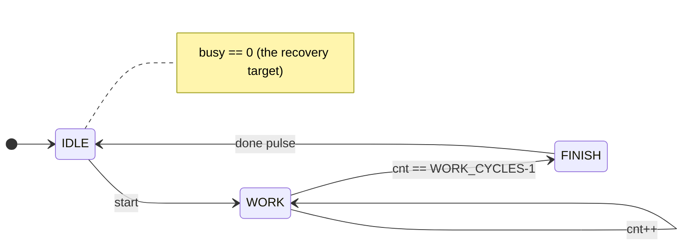
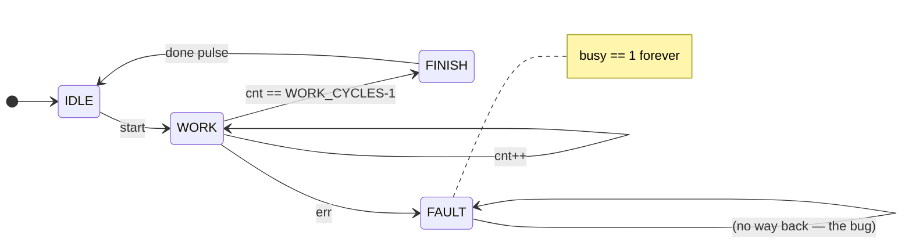

# Recoverability — the branching-time differentiator

> Concept: what a *recoverability* property is and why a safety-only tool cannot express it.

This directory holds a **contrast pair** of small, self-contained `load → busy → done` compute
cores that demonstrate — reproducibly, on RTL this repository owns — the class of property that
separates mununu's 3-valued KMTS μ-calculus engine from a bit-level safety checker (SVA assertions,
plain BMC/k-induction):

- [`compute_engine.sv`](compute_engine.sv) — **recovers**: `AG EF(busy==0)` **HOLDS**.
- [`compute_engine_faulty.sv`](compute_engine_faulty.sv) — the same core with one missing recovery
  edge, so it **locks up**: `AG EF(busy==0)` is **VIOLATED**, and mununu returns the trap trace.

Same command, same core, opposite verdict — the [execution planner](../../crates/mununu-core/src/planner/mod.rs)
routes both to the exact-symbolic engine and returns a *definite* answer (a trace, not a shrug).

## The property

> Source of truth: [`compute_engine.sv`](compute_engine.sv) — surface: CLI (`sv verify-auto`) + API + UI

The core carries three `@mununu_guarantee` annotations (μ-calculus, verified through the same
pipeline as translated SVA):

| # | formula | meaning |
|---|---|---|
| 0 | `nu Y.((mu X.(busy==0 \|\| <> X)) && [] Y)` | **`AG EF(busy==0)`** — from *every* reachable state, the core can return to idle |
| 1 | `mu Z.(busy==1 \|\| <> Z)` | **`EF(busy==1)`** — *non-vacuity witness*: `busy` is genuinely reachable |
| 2 | `nu Y.((mu X.(done==1 \|\| <> X)) && [] Y)` | **`AG EF(done==1)`** — the core can *always* complete a computation |

Property 0 is the differentiator. A safety checker can only say *"`busy` is low on this trace"*;
only a branching-time engine says *"idle is **always re-reachable**, from anywhere"* — an `AG EF`
(a `μ` inside a `ν`) that collapses under plain over- or under-approximation. Property 1 is the
**non-vacuity gate**: without it, `AG EF(busy==0)` would hold trivially if `busy` were stuck at 0
(a signal that never leaves the target is "recoverable" for free). Because `busy` genuinely toggles
(0 on idle, 1 on `start`) and the FSM always returns to `IDLE`, the HOLDS is a *real* recoverability
claim.

## Run it

The properties are verified out of reset (the standard formal reset discipline — pin the reset to
its inactive value so recovery is proved via the design's own logic, not a reset escape):

```console
$ mununu sv verify-auto examples/recoverability/compute_engine.sv \
      --top compute_engine --config-value rst_n=1
```

No `--engine` flag: the default is the **execution planner's portfolio**, which routes this small
control cone to the exact-symbolic engine automatically (a definite verdict transfers to the RTL):

```
  reset-gated (pinned inactive): rst_n=1
  [assert] ann_guarantee_0: HOLDS
  [assert] ann_guarantee_1: HOLDS
  [assert] ann_guarantee_2: HOLDS
  [coverage-summary] 3 assertion(s): 3 definite (HOLDS), 0 violated, 0 unknown, 0 skipped
  [portfolio] portfolio-sequential: 3/3 properties decided (ran: exact-symbolic)
```

The `busy`/`done` cone is the small FSM (`state`, `cnt`); the 32-bit `result` datapath is out of
cone, so the planner's exact BDD engine decides all three in milliseconds.



## The contrast — a lockup a safety checker misses

> Source of truth: [`compute_engine_faulty.sv`](compute_engine_faulty.sv) — surface: CLI (`sv verify-auto`) + API + UI

[`compute_engine_faulty.sv`](compute_engine_faulty.sv) is the **same core with one realistic
defect**: an `err` strobe during `WORK` sends the FSM to a `FAULT` state that has **no edge back to
`IDLE`** — the designer forgot the recovery transition. Nothing short of a reset clears it, so once
faulted the core is **busy forever**.



Verified reset-pinned (recovery must be via the design's *own* logic, not the reset escape):

```console
$ mununu sv verify-auto examples/recoverability/compute_engine_faulty.sv \
      --top compute_engine_faulty --config-value rst_n=1
```

```
  [assert] ann_guarantee_0: VIOLATED (1 cell(s))
        formula: nu Y.((mu X.(busy==0 || <> X)) && [] Y)
        counterexample (stall lasso):
          -> cnt=0, state=0   (IDLE)
          -> cnt=0, state=1   (WORK)
          (*) cnt=0, state=3  (FAULT)
          (cycle repeats forever - the property is avoided)
  [assert] ann_guarantee_1: HOLDS
```

mununu returns the **exact trap path** `IDLE → WORK → FAULT` and proves `busy==0` is unreachable
from there. The non-vacuity witness (`EF(busy==1)`) still HOLDS, so this is a *real* lockup, not a
stuck-signal artifact.

### Why a safety / linear-time checker cannot state this

| you want to say | in SVA / LTL | problem |
|---|---|---|
| "`busy` drops within N cycles" | `assert property (busy \|-> ##[1:N] !busy)` | needs a **bound** `N`; a genuine lockup has none, and guessing `N` turns a proof into a heuristic |
| "`busy` eventually drops" | `s_eventually !busy` | **linear** liveness — fairness-sensitive, and over an over-approximation it is unsound or undecidable |
| "from **every** reachable state, idle is **still reachable**" | *(not expressible)* | this is **branching** (`AG EF`): a `∀`-states, `∃`-path claim no single linear trace can express |

`AG EF(busy==0)` is a `μ` inside a `ν` — an alternating fixpoint that collapses under plain over- or
under-approximation. mununu's 3-valued KMTS engine decides it soundly at every alternation depth
(Bruns–Godefroid), and the **execution planner** routes it: the portfolio's exact-symbolic engine
takes the small `busy` cone and returns a *definite* VIOLATED with the trap trace.

<!-- [TODO: prose] Lead the article HERE — open with the two-line contrast (recovers vs. locks up)
     and the trap trace, before any mention of engines or fixpoints. The reader should feel the bug
     first. -->
<!-- [TODO: prose] One paragraph on WHY this bug class matters in real silicon: sticky error states
     with a missing recovery edge are a common RTL defect; a safety regression suite that only
     checks "bad never asserts" sails right past a core that is merely stuck. -->
<!-- [TODO: prose] Close the loop back to the planner: same command, same core, opposite verdict —
     the planner picked the right engine (exact over a small cone) and produced a trace, not a
     shrug. Tie to the "lift once, route by structure" narrative. -->

## Why isolation is enough here

Unlike a *bus controller* (I2C/SPI), whose activity needs an external protocol partner and is
therefore unreachable in module isolation (its "recoverability" is vacuous when verified alone),
this core's `WORK` phase advances on its **own clock with no external handshake**. So the whole
`busy ↔ idle` cycle is reachable in isolation, and the recoverability is genuinely exercised — the
design-selection criterion for a *meaningful* self-contained recoverability check.

## Provenance

Authored in this repository (clean-room, under the repo's license) specifically as a public
reproducer. It is a minimal analog of the same property class mununu decides on real compute cores
(crypto round-FSMs, DSP pipelines) — those measurements live in the project's private benchmark
ledger; this example is the runnable demonstration of the capability.
